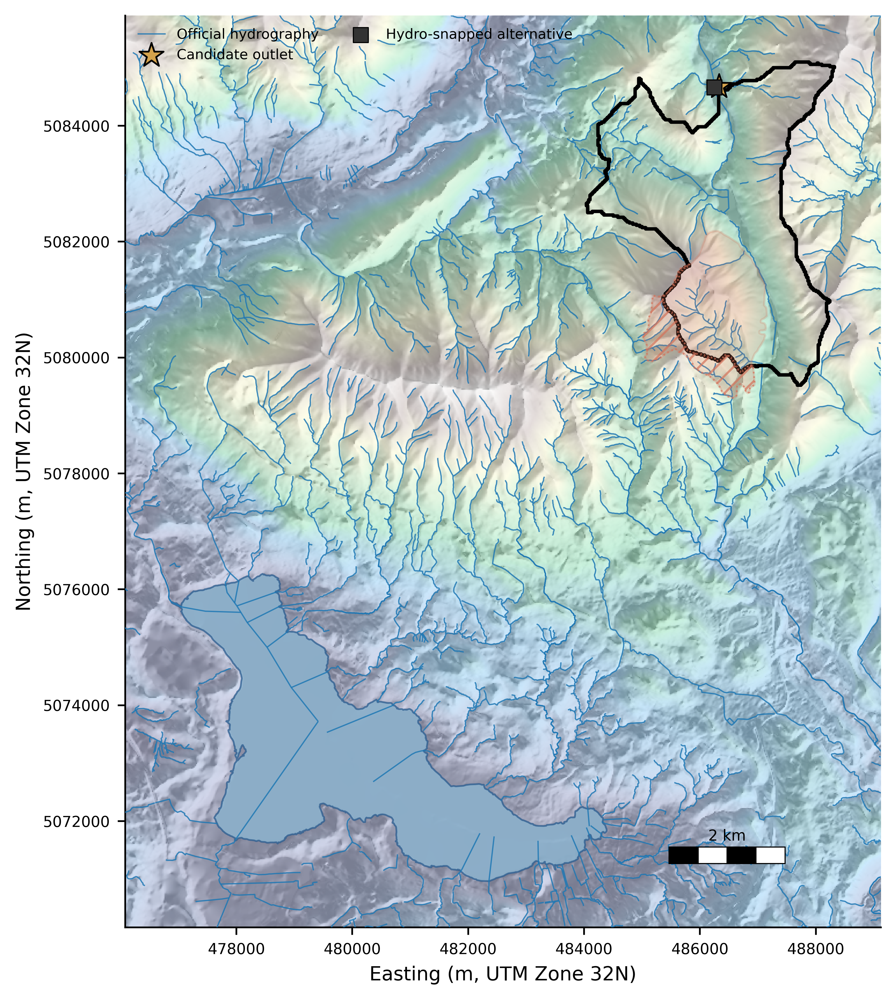
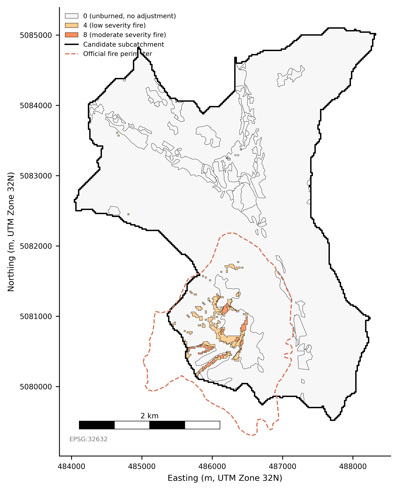
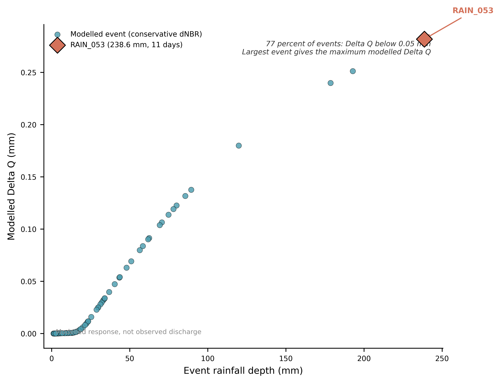
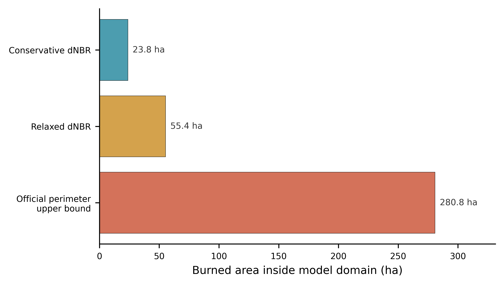
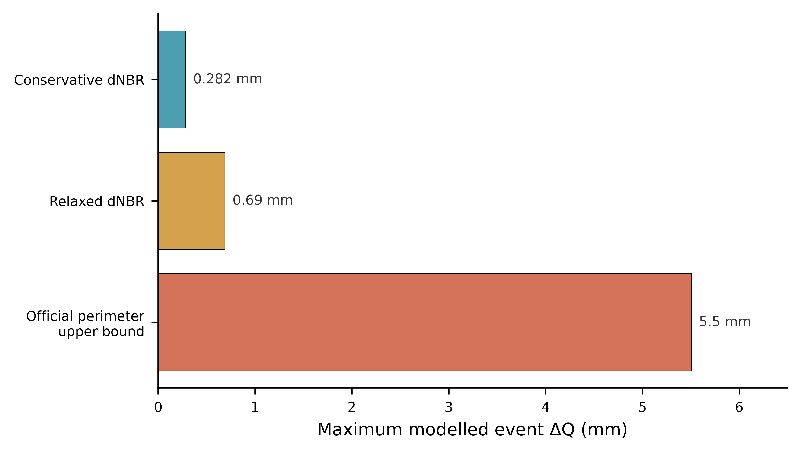
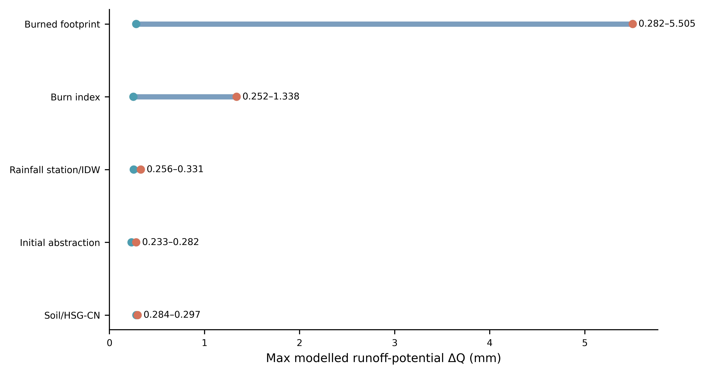
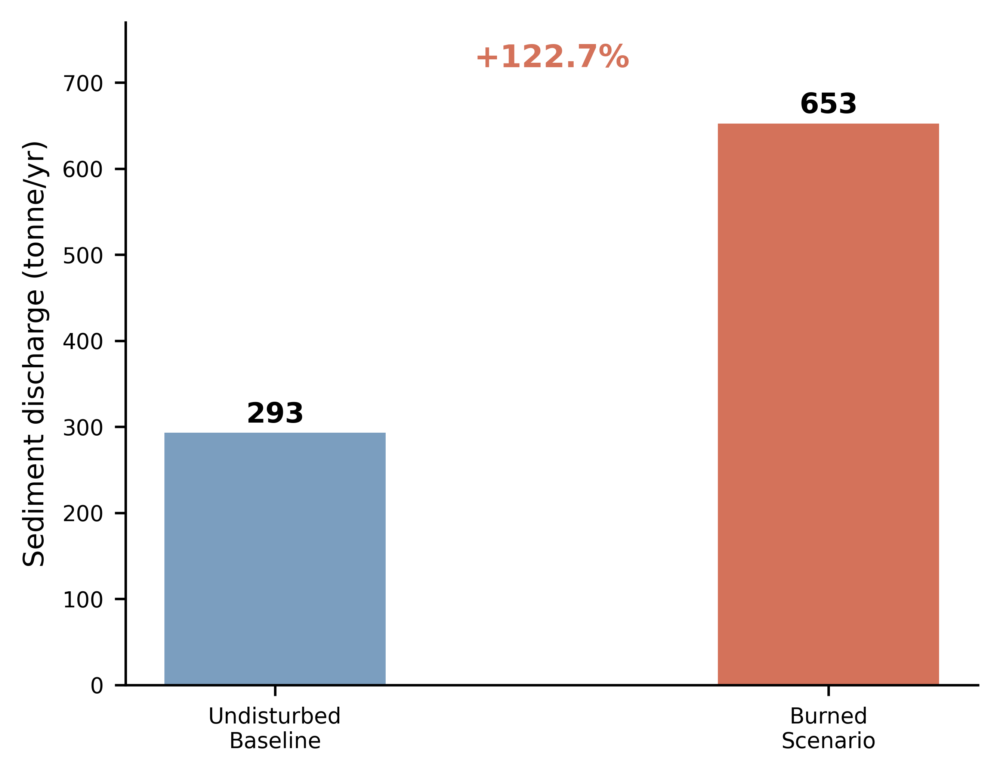

# GeoProject — Post-fire Runoff Screening

Reproducible screening-level GIS workflow for post-wildfire runoff sensitivity analysis.
Local SCS-CN event runoff model with WEPPcloud-EU benchmark and Python-only lake
water-quality proxy closure.

## Study area



The reference implementation covers the Monte Martica 2019 wildfire near Lake Varese,
Lombardy, Italy. The DEM-derived catchment is 1,311.76 ha with 376.25 ha official fire
perimeter (74.5% inside the catchment).

## Key results

| Metric | Value |
|---|---|
| Conservative dNBR burned proxy | 23.80 ha (1.8% of catchment) |
| Max conservative delta Q | 0.282 mm |
| Upper-bound delta Q | 5.505 mm |
| WEPPcloud sediment | 293 to 653 tonne/yr (+122.7%) |

Burned-footprint definition dominates the uncertainty envelope.

## Runoff response



SCS-CN response units combine land cover, soil HSG, and dNBR burn severity class.
Curve-number adjustments are applied only where positive burn classes exist.



92 observed 2019-2020 rainfall events modelled with baseline and burned SCS-CN
parameters. The largest event (RAIN_053, 238.6 mm) produces the maximum conservative
delta Q of 0.282 mm.

## Uncertainty hierarchy




Three burned-footprint definitions span from 23.80 ha (conservative dNBR) to
280.76 ha (official fire perimeter upper bound), driving max delta Q from
0.282 mm to 5.505 mm.



Burned-footprint definition is the dominant uncertainty source, wider than
burn index choice, rainfall station, initial abstraction ratio, or soil HSG.

## WEPPcloud benchmark



WEPPcloud-EU provides an independent process-model benchmark. Sediment discharge
increases 122.7% while stream discharge changes negligibly. WEPPcloud is a
benchmark, not validation of the local SCS-CN model.

## Quick start

```bash
conda env create -f environment.yml
conda activate geoproject
streamlit run webapp/app.py --server.headless true
```

## Documentation

| Document | Purpose |
|---|---|
| `docs/USER_MANUAL.md` | Setup and workflow overview |
| `docs/DATA_REQUIREMENTS.md` | Required input data and formats |
| `docs/WEB_INTERFACE.md` | Streamlit web app usage |
| `docs/TROUBLESHOOTING.md` | Common problems and solutions |

## Scientific guardrails

- Local runoff outputs are screening-level, uncalibrated scenario estimates.
- dNBR is a remote-sensing burn-severity proxy, not field soil burn severity.
- WEPPcloud is a benchmark, not validation of local SCS-CN.
- Lake WQ is Python-only; NDTI is primary (turbidity), NDCI is secondary and indirect.
- All processing uses local data.
