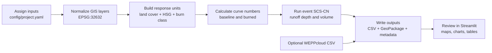

# Post-fire Runoff Screening Tool

A Python and Streamlit tool for event-scale post-fire runoff screening with the SCS-CN method. It combines configured spatial layers and rainfall events into response units, calculates baseline and burned curve numbers, and writes maps and tables for review.

The SCS-CN outputs are uncalibrated event-scale scenario estimates. Burn classes derived from remote sensing represent burn-severity proxies. WEPPcloud outputs are presented as an external comparison with different model and temporal scales.

## Workflow at a glance



## Repository structure

```text
postfire_runoff/backend/      GIS normalization, response units, SCS-CN calculation, uploads
postfire_runoff/cli/          command-line pipeline entry point
postfire_runoff/frontend/     Streamlit app and page/components
config/                       project and sample YAML configuration
sample_data/                  synthetic data generator for verification
docs/                         method and data requirements
tests/                        focused regression tests
```

## Required inputs

Configure these keys in `config/project.yaml` or assign them from the Streamlit **Data** page:

| Input | Config key | Formats |
|---|---|---|
| Catchment boundary | `inputs.catchment_boundary` | GeoPackage, GeoJSON |
| Official fire perimeter | `inputs.fire_perimeter` | GeoPackage, GeoJSON |
| Burn severity | `inputs.burn_severity` | GeoPackage, GeoJSON, GeoTIFF |
| Land cover | `inputs.land_cover` | GeoPackage, GeoJSON |
| Hydrologic soil group | `inputs.hsg` | GeoPackage, GeoJSON |
| Rainfall events | `inputs.rainfall_events` | CSV |
| WEPPcloud export | `inputs.weppcloud_export` | optional CSV |

Spatial processing uses EPSG:32632. Web display and geographic exchange use EPSG:4326.

## Setup

```bash
conda env create -f environment.yml
conda activate geoproject
```

For tests in a development environment:

```bash
python -m pip install pytest
```

## Sample verification

```bash
python sample_data/create_sample_data.py
python -m postfire_runoff.cli.run_pipeline --config config/sample.yaml --force
```

## Real project configuration

1. Prepare the six required core inputs listed above.
2. Start Streamlit and use **Data → Upload files** to save each file and assign the matching `inputs.*` key, or edit `config/project.yaml` manually with paths relative to the repository root.
3. Review **Data → Required files** after a pipeline run.

## Runtime commands

Run the configured project from the command line:

```bash
python -m postfire_runoff.cli.run_pipeline --config config/project.yaml --force
```

Launch the Streamlit interface:

```bash
streamlit run postfire_runoff/frontend/app.py --server.headless true --server.port 8501
```

Open <http://127.0.0.1:8501>.

## Generated outputs

```text
data/processed/boundary/catchment_utm32.gpkg
data/processed/fire_perimeter/fire_perimeter_utm32.gpkg
data/processed/burn/burn_severity_proxy_uint8.tif
data/processed/model_inputs/runoff_units.gpkg
data/processed/weather/post_fire_rainfall_events.csv
outputs/tables/runoff_units.csv
outputs/tables/runoff_event_summary.csv
outputs/tables/runoff_delta_by_event.csv
outputs/tables/burn_severity_area_summary.csv
outputs/tables/weppcloud_summary.csv        # only when a valid user export is configured
outputs/run_metadata.json
```

`runoff_units.csv` contains `unit_id`, `landcover_class`, `hsg`, `burn_class`, `baseline_cn`, `burned_cn`, `cn_adjustment`, `area_m2`, and `area_ha`.

## Limitations

- The tool screens event-scale direct runoff depth and volume; it is not a calibrated discharge model.
- Land-cover, HSG, burn severity, and rainfall inputs must be supplied by the user.
- Burn-footprint scenarios require separate spatial burn masks and full reruns.
- WEPPcloud is imported only from user-exported CSV files; this repository does not run WEPPcloud.

See `docs/MODEL_METHOD.md` and `docs/DATA_REQUIREMENTS.md` for details.
