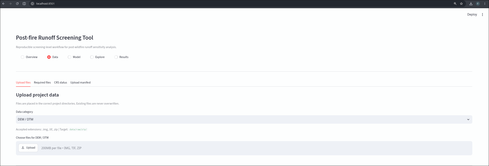
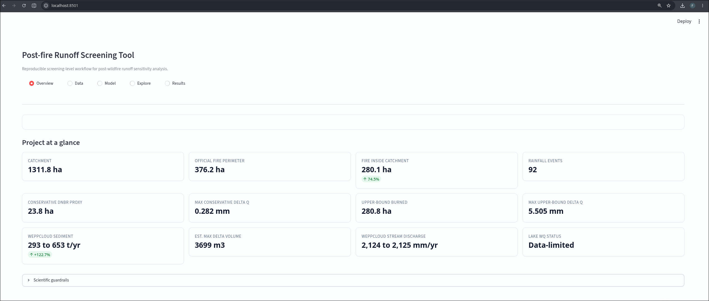
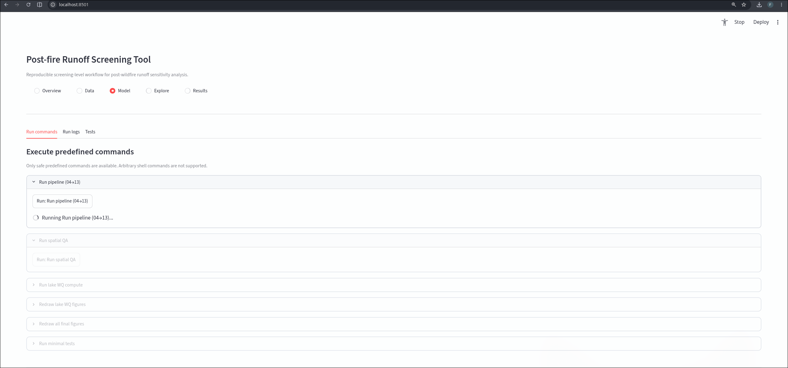
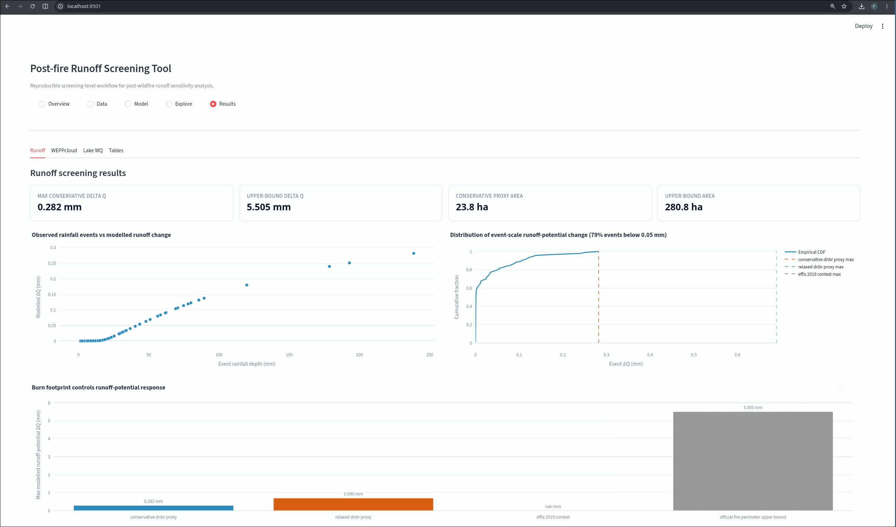
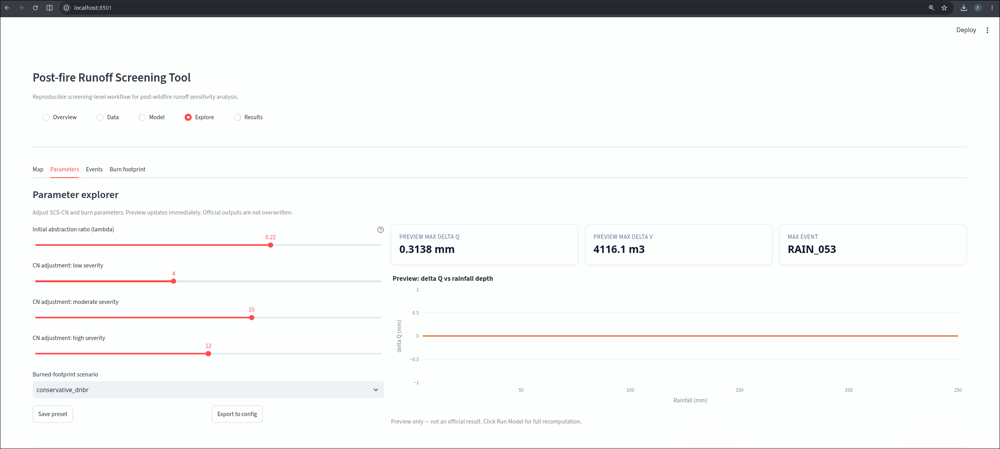
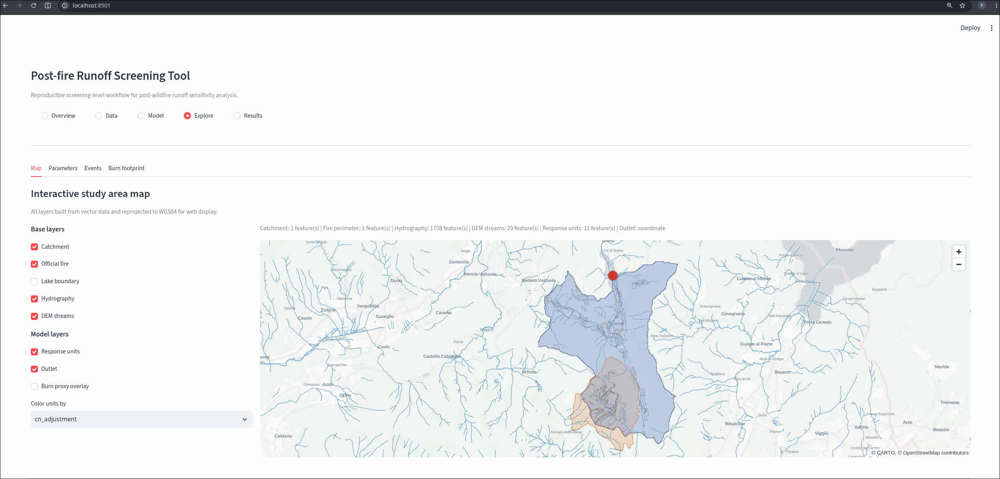

# Post-fire Runoff Screening Tool

A reproducible, screening-level GIS workflow for post-wildfire runoff sensitivity
analysis. Provide your own input data, run the pipeline, and explore results through
the web interface.

## Quick start

```bash
conda env create -f environment.yml
conda activate geoproject
streamlit run postfire_runoff/webapp/app.py --server.headless true --server.port 8501
```

Open `http://localhost:8501`.

## Prepare your data

Use the **Data** tab in the web interface to upload project files through the browser.
Manual placement under `data/raw/zip/` is available as a fallback for advanced use.

The tool expects:

| Dataset | Accepted formats | Notes |
|---|---|---|
| DEM | `.zip` (GeoTIFF or IMG inside) | Required for catchment delineation and hydrology |
| Fire perimeter | `.zip`, `.gpkg`, `.shp` | Official burned area polygon |
| Sentinel-2 L2A | `.SAFE.zip` | Must be L2A (MSIL2A), not L1C |
| Land cover | `.zip`, `.gpkg` | Vector land cover map |
| Soil / HSG | `.tif`, `.zip`, `.csv` | Hydrologic soil group or texture data |
| Rainfall | `.zip`, `.csv` | Hourly or daily precipitation time series |

## Upload data through the web interface

1. Launch the web app and go to the **Data** tab.



2. Select a data category from the dropdown.

3. Choose files from your computer. The tool validates file extensions per category.

4. Files are saved into `data/raw/zip/`. Existing files are never overwritten.

5. Use the **Required files** subtab to check what is present.

6. The **Detected products** subtab shows recognised Sentinel-2 scenes with sensing dates.

After uploading, run the pipeline from the **Model** tab or the command line:

```bash
python -m postfire_runoff.cli.run_pipeline
python -m postfire_runoff.cli.run_lake_wq
```

## Parameters are adjustable in the browser

The Explorer tab lets you change SCS-CN initial abstraction ratio, burn severity
CN adjustments, and footprint scenario with sliders. A live sensitivity preview
chart updates immediately. No need to re-run the pipeline. Presets can be saved
and exported to the project configuration.

## Web interface

### Overview



Landing page with metric cards and scientific guardrails.

### Data


Upload files and check which inputs are present.

### Explorer — Map



Interactive pydeck map with toggleable vector layers. A status line shows which
files are loaded and which are missing. The basemap always renders.

### Explorer — Parameters



Adjust SCS-CN parameters with sliders. The preview chart updates instantly.

### Results — Runoff and WEPPcloud



Runoff delta tables, event scatter and CDF charts, burn footprint bar chart,
WEPPcloud sediment benchmark.

### Results — Lake WQ



Lake water-quality closure status. Shows which events have Sentinel-2 coverage.
Reports missing data rather than generating fake values.

## Scientific guardrails

- All runoff outputs are screening-level, uncalibrated scenario estimates.
- dNBR is a remote-sensing burn-severity proxy, not field soil burn severity.
- WEPPcloud is an independent benchmark, not validation of the local SCS-CN model.
- Lake water-quality indices (NDTI, NDCI) are screening-level optical proxies.
- The tool uses local input files only.

## Documentation

| Document | Purpose |
|---|---|
| `docs/USER_MANUAL.md` | Setup and workflow guide |
| `docs/DATA_REQUIREMENTS.md` | Required input data and formats |
| `docs/WEB_INTERFACE.md` | Web app screenshots and navigation |
| `docs/TROUBLESHOOTING.md` | Common problems and solutions |

## License

GPLv3. See [LICENSE](LICENSE).
