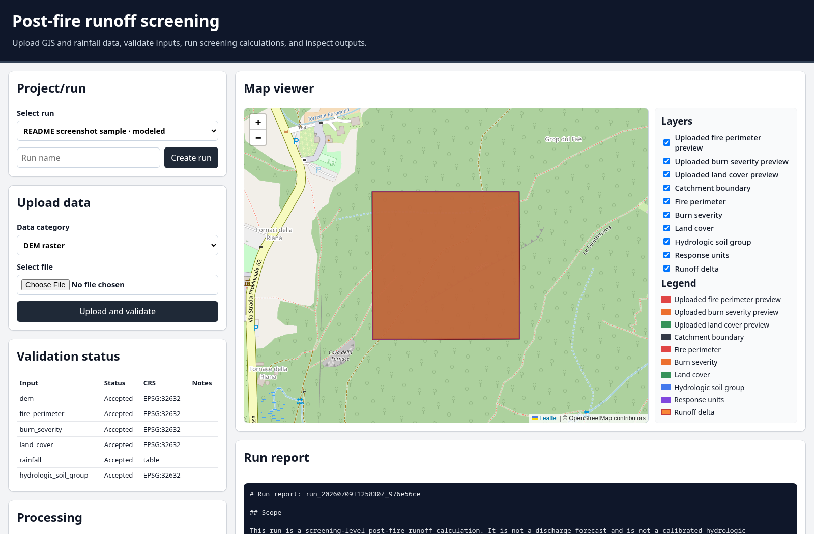

# Web GIS runoff screening tool

A standalone Web GIS application for post-fire runoff screening over a burned catchment.

The normal workflow is browser upload. Manual file placement is secondary and should be used only for recovery or controlled local setup.



## What this tool does

- Upload DEM, vector, raster, and rainfall files through the browser.
- Validate CRS, geometry, raster metadata, rainfall columns, and archive safety before accepting files.
- Store accepted files under an isolated `runs/<run_id>/inputs/` directory.
- Normalize spatial inputs to EPSG:32632 for analysis.
- Write browser display layers in EPSG:4326.
- Run a documented screening-level SCS-CN event runoff calculation.
- Write tables, map layers, QA files, a run report, and `run_manifest.json`.

## What this tool does not do

- It does not forecast discharge.
- It does not replace field-validated burn severity, soil, or hydrologic calibration.
- It does not fabricate production input data when required files are missing.
- It does not use GitHub Actions or workflow files.

## Quick start

### Backend

Use Python 3.11 or newer with GDAL-compatible wheels or a conda environment.

```bash
cd backend
python -m venv .venv
source .venv/bin/activate
python -m pip install -e '.[test]'
uvicorn app.main:app --reload --host 127.0.0.1 --port 8000
```

Health check:

```text
http://127.0.0.1:8000/api/health
```

### Frontend

```bash
cd frontend
npm install
npm run dev
```

Open:

```text
http://127.0.0.1:5173
```

The Vite development server proxies `/api` requests to `http://127.0.0.1:8000`.

## Browser workflow

1. Create or select a run.
2. Upload each required file in **Upload data**.
3. Check **Validation status**.
4. Run **Run preprocessing**.
5. Run **Run runoff model**.
6. Inspect generated layers in **Map viewer**.
7. Download outputs and read the run report.

Required production inputs:

- DEM raster
- fire perimeter or burned area
- burn severity
- land cover
- hydrologic soil group
- rainfall event CSV

HSG may be supplied by an explicit per-run fallback only when the user chooses it. The chosen fallback is recorded in the manifest and report.

## Runtime storage

Every run writes:

```text
runs/<run_id>/
  inputs/
  normalized/
  outputs/
  logs/
  reports/
  run_manifest.json
```

`run_manifest.json` records input filenames, checksums, CRS, raster resolution, bounds, NoData, selected parameters, generated outputs, output checksums, warnings, and fatal errors.

## Repository layout

```text
backend/      FastAPI application and GIS processing services
frontend/     React + Vite browser application with Leaflet map
docs/         User and operator documentation
sample_data/  Small sample-data generator for local checks
tests/        Pytest tests for backend validation and model logic
runs/         Local run storage; generated at runtime
```

## Local tests

```bash
cd backend
source .venv/bin/activate
cd ..
pytest
```

Raster tests require `rasterio`.

## Documentation

- `docs/USER_MANUAL.md`: browser workflow
- `docs/DATA_REQUIREMENTS.md`: required files, formats, CRS rules, CSV columns
- `docs/OUTPUTS.md`: output files, units, interpretation limits
- `docs/RUNBOOK.md`: troubleshooting and recovery
