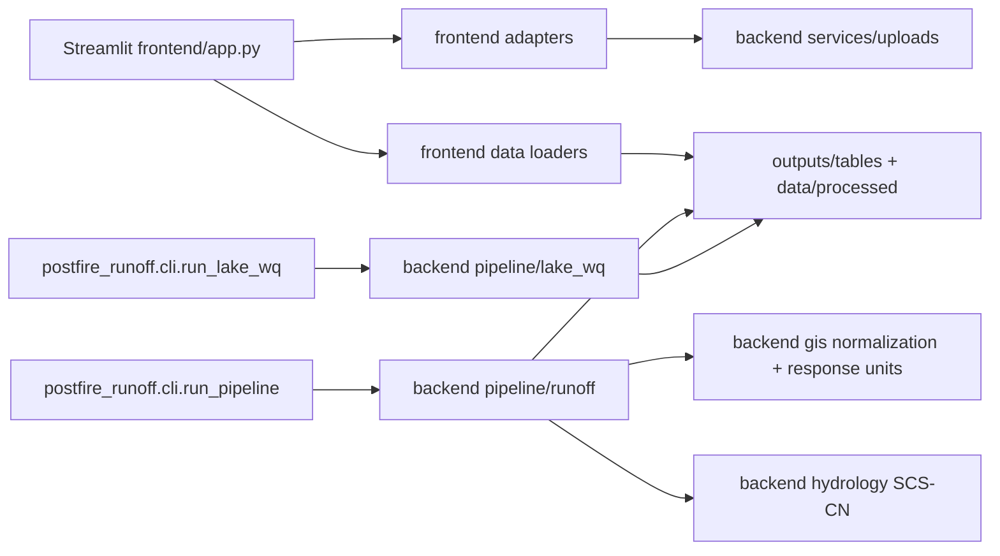

# Architecture

| Area | Responsibility |
|---|---|
| `postfire_runoff/frontend/app.py` | Single Streamlit entry point and fixed UI layout. |
| `postfire_runoff/frontend/components/` | Rendering helpers, charts, maps, data loaders. |
| `postfire_runoff/frontend/adapters.py` | Thin bridge to backend upload service and config values. |
| `postfire_runoff/backend/config.py` | YAML loading and root/path resolution. |
| `postfire_runoff/backend/gis/` | CRS checks, vector normalization, burn classes, response units. |
| `postfire_runoff/backend/hydrology/` | Curve-number lookup and the single SCS-CN implementation. |
| `postfire_runoff/backend/pipeline/` | Core runoff pipeline and optional lake status stage. |
| `postfire_runoff/backend/services/` | Upload validation/storage and WEPPcloud CSV import. |
| `postfire_runoff/cli/` | Thin argument parsers with meaningful exit codes. |

## Pipeline state

`outputs/run_metadata.json` records status, input/output paths and checksums, processing CRS, warnings, optional-stage status, and response-unit coverage diagnostics. The pipeline returns zero only after all required core outputs are complete.

## Key schemas

`outputs/tables/runoff_units.csv`: `unit_id`, `landcover_class`, `hsg`, `soil_group`, `burn_class`, `baseline_cn`, `burned_cn`, `baseline_parameter`, `burned_parameter`, `cn_adjustment`, `area_m2`, `area_ha`.

`outputs/tables/runoff_event_summary.csv`: `event_id`, `start_date`, `end_date`, `rainfall_mm`, `baseline_runoff_mm`, `burned_runoff_mm`, `delta_runoff_mm`, `baseline_volume_m3`, `burned_volume_m3`, `delta_volume_m3`, `response_unit_area_m2`, `initial_abstraction_ratio`.
