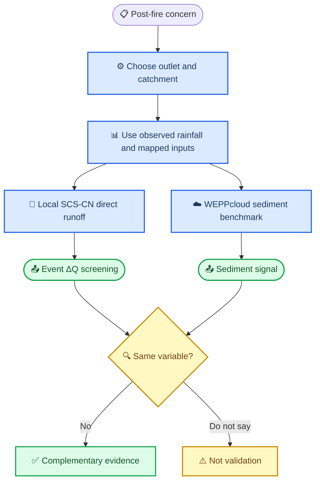

# Lake Varese / Monte Martica post-fire runoff screening：两小时中文汇报讲稿

> 使用方式：这份稿子不是逐字背诵稿，而是“按页讲解 + 预设问答 + 证据索引”。中文叙述中保留 English terminology，避免把专业词硬翻译导致误解。所有本项目数字来自当前 repository 输出；外部方法背景见文末 footnotes。所有本地 runoff 结果都必须表述为 **screening-level、uncalibrated、scenario estimate**，不能说成 observed 或 calibrated result。

---

## 00｜Topic page：在第一页前新增一页

这一页只放题目、地点、方法关键词和一句话研究问题，不要放太多文字。

**建议标题**：

**Post-fire runoff screening for Lake Varese / Monte Martica**  
**Local SCS-CN event model + WEPPcloud-EU benchmark**

**我会这样开场**：

大家好。今天我讲的是 Monte Martica 2019 wildfire 之后，Lake Varese 上游 burned catchments 的 **post-fire runoff screening**。这不是一个已经校准过的预报系统，也不是现场观测证明，而是一个 reproducible GIS workflow：把 rainfall、DTM、land cover、soil/HSG、burn severity proxy 和 outlet/catchment delineation 组织起来，估算 fire 可能怎样改变 event-scale direct runoff，并把本地 simplified SCS-CN model 与 WEPPcloud-EU 的 process-based benchmark 做对比。

最简单地说，问题是：**同样一场 rainfall event，如果火灾前地表有森林和植被，火灾后有一部分地表变裸露或渗透能力下降，runoff、sediment delivery 和 downstream water-quality risk 的方向和大小会怎样变化？**

这页只讲目的：我们不是为了“做一个漂亮地图”，而是为了把从 rainfall 到 runoff、从 burn footprint 到 catchment outlet 的逻辑链条讲清楚，并且用数字说明哪些结论可靠、哪些只是 screening assumption。

---

## 01｜First principles：先用 Feynman 方法解释这个题目

如果 audience 没有 hydrology 背景，我会先这样解释。

想象一场雨落到山坡上。火灾前，地表有 canopy、litter、root system 和比较完整的 soil structure。雨水的一部分被 vegetation interception 拦截，一部分 infiltration 到 soil，一部分沿坡面形成 overland flow。火灾后，如果 vegetation cover 降低、ash layer 改变地表性质、soil water repellency 增加，或者 surface roughness 下降，同样的 rainfall 可能更容易变成 **direct runoff**，也更容易动员 fine sediment、nutrients 和 particulate matter，进入 downstream channel，最后影响 lake 或 reservoir。

但是这里有一个关键点：**“火烧了”不等于“整个官方 fire perimeter 都以同样强度产生 runoff”。** 我们必须回答四个 first-principles 问题：

1. 雨落在哪里、多少、什么时候落？这对应 rainfall events 和 station selection。
2. 水往哪里流？这对应 DTM、D8 flow direction、flow accumulation、stream network、catchment outlet 和 watershed delineation。
3. 地表能吸收多少水？这对应 land cover、soil/HSG、Curve Number 和 burn severity proxy。
4. 被火影响的 footprint 到底多大？这对应 official fire perimeter、dNBR、conservative/relaxed/upper-bound burn footprint。

所以我的报告从一开始就要强调：这个 project 的核心不是一个单独的 map，而是一个 chain of evidence。每一步都有输入、输出、单位、CRS、uncertainty 和 validation records。

---

## 02｜Main findings：先给结论，再解释过程

如果只用 3 分钟概括当前结果，我会这样说。

第一，当前 local SCS-CN model 的模型范围不是一个随意 box，而是一个 DEM-derived candidate catchment，面积 **1,311.76 ha**。官方 Monte Martica fire perimeter 面积是 **376.25 ha**，其中 **280.14 ha，也就是 74.5%** 落在当前 catchment 内。换句话说，当前 outlet 能代表官方火场的一部分 drainage area，但不能完整代表整个 official fire site。

第二，当前 conservative dNBR proxy 只识别出 **23.80 ha** burned proxy area，占 catchment 的 **1.8%**。因此在 observed 2019–2020 rainfall events 下，local SCS-CN 的 burned-minus-baseline 最大 event runoff change 只有 **0.282 mm**，约 **3,696 m³**。这个小数值并不表示“火灾没有影响”，而是表示：在当前 conservative burn footprint 定义下，被调整 CN 的面积很小。

第三，如果使用 fire-perimeter upper-bound，也就是把当前 catchment 内官方 fire footprint 都当作 burned，burned footprint 变成 **280.76 ha，占 21.4%**，最大 event runoff-potential change 上升到 **5.505 mm**，约 **72,208 m³**。这说明当前 uncertainty 的主导因素是 **burned-footprint definition**，不是公式本身。

第四，WEPPcloud-EU benchmark 与 local SCS-CN 不是同一个模型。WEPPcloud 的 watershed 是 **1,073.66 ha**，比 local catchment 小 **18.2%**；它的 disturbed vs undisturbed comparison 显示 sediment discharge 从 **293.0 tonne/yr** 增加到 **652.6 tonne/yr**，增加 **122.7%**，但 stream discharge 只从 **2,124** 到 **2,125 mm/yr**。所以 WEPPcloud 的主要 fire signal 是 sediment，而不是 annual stream discharge。

这一页后面可以加一句：**本项目目前最稳妥的 conclusion 是：burn footprint 定义决定了 local runoff response 的大小；WEPPcloud 支持“burned hillslope erosion/sediment risk increases”的方向，但不能验证 local SCS-CN runoff 数值。**


---

## 02A｜把 research question、constrained problem 和模型范围串起来

你现在觉得 research question 和前面的背景接不上，原因是原来的叙事容易从“fire may increase runoff”直接跳到“我建了一个 model”。中间缺了一步：**为什么这个问题必须被 constrained**。

更顺的 research question 应该这样说：

> For the part of the Monte Martica 2019 official fire perimeter that drains to the selected Lake Varese tributary outlet, how much can post-fire burn-condition assumptions change event-scale direct runoff under observed 2019–2020 rainfall, and how does this local runoff screening compare with WEPPcloud-EU sediment and water-balance signals?

这句话比原来的问题更受约束，因为它同时限定了五件事：

| Constraint | Plain meaning | Why it matters |
|---|---|---|
| `selected outlet` | 我只研究流到这个出口的上游 catchment | official fire perimeter 不是全部流到同一 outlet |
| `event-scale direct runoff` | local model 只算 rainfall event 的 direct runoff | 不算 annual water balance、baseflow、sediment |
| `observed 2019–2020 rainfall` | local rainfall 来自 Station 907 的 92 events | 不是 WEPPcloud 100-year climate |
| `burn-condition assumptions` | fire effect 通过 burn footprint 和 CN adjustment 表示 | 没有 field soil burn severity，所以不能 overclaim |
| `WEPPcloud-EU benchmark` | WEPPcloud 用来比较 sediment/water balance signal | 它不是 local SCS-CN 的 validation |

所以“problem constrained”的核心不是项目做小了，而是水文学上必须这样做：水从哪个 burned slope 到哪个 outlet，是由 topography 和 drainage network 决定的；不是整个 official fire polygon 都自动影响同一个 outlet。当前 quantitative validation 显示，official fire perimeter 只有 **74.455%** 在 current catchment 内，约 **25.545%** 在外。因此 current local model 是一个 defensible single-outlet baseline，不是 whole-fire model。

讲的时候可以用一句过渡：**The broad environmental concern is post-fire runoff and sediment risk, but the calculable research question must be constrained by outlet, catchment, rainfall period, burn footprint, and model capability.**



---

## 03｜Current reality：实际使用了什么数据，而不只是收集了什么数据

这一页要解决 audience 最容易问的问题：“你到底用了哪些数据？哪些只是下载了但没进模型？”

当前实际进入 local workflow 的数据包括：

- **DTM / DEM**：本地 Lombardia DTM，处理后输出 `data/processed/dem/dem_utm32.tif`，working resolution **20 m**，CRS **EPSG:32632**。它用于 D8 hydrology、flow direction、flow accumulation、stream extraction 和 catchment delineation。
- **Official fire perimeter**：`data/processed/fire_perimeter/monte_martica_fire_2019_utm32.gpkg`。它来自 Regione Lombardia 的 `Aree percorse dal fuoco`，当前选择的 fire candidate 是 2019-01-03，Monte Martica / Varese，面积 **376.25 ha**。
- **Sentinel-2 dNBR proxy**：pre-fire `2019-01-02` 与 post-fire `2019-01-10` 的 Sentinel-2 L2A SAFE ZIP。用 B08 和 B12 计算 NBR，再算 dNBR，输出 `burn_severity_proxy_uint8.tif`。当前 valid burn classes 是 0、1、2、255；没有 class 3 high severity pixels。
- **DUSAF6 2018 land cover**：用于把 catchment 里的 land cover 重分类为 forest、shrub、grassland、agriculture、urban、water 等 hydrologic classes。当前 catchment 中 forest 约 **1,125.1 ha，占 85.8%**。
- **Soil / HSG**：当前 HSG 来自 SoilGrids-derived texture / local soil processing，输出 `hydrologic_soil_group.tif`。当前有效像元全部为 HSG D，分辨率 **250 m**，比 DEM 20 m 粗 **12.5 倍**，因此 soil conclusion 只能是 screening assumption。
- **Rainfall**：当前 main local rainfall station 是 **Station 907 VARESE - v.Appiani [8228]**，2019–2020 分割出 **92 rainfall events**，event total precipitation 合计 **2,593.0 mm**，最大 event **238.6 mm**。
- **WEPPcloud outputs**：已经有 disturbed run `doomed-launcher` 和 undisturbed run `radio-pricing` 的 exported CSV/GPKG/PDF summary，用于 benchmark comparison。

当前只作为 sensitivity 或 context 的数据包括：其他 rainfall stations、lake water-quality analytical table、fluvial observations、EFFIS severity、relaxed dNBR threshold、fire-perimeter upper-bound scenario。它们很重要，但不能被说成 calibration evidence。

---

## 04｜Model range：我们的模型范围到底是什么？

这里一定要把 “AOI”、“box”、“catchment”、“fire perimeter”、“WEPPcloud watershed” 分清楚。

**我会这样讲**：

我们项目里有几个不同的 spatial extent，它们不是同一个东西。

第一，用户给的 box：

```text
west = 8.70
south = 45.78
east = 8.92
north = 45.94
CRS = EPSG:4326
```

这是一个 WGS84 longitude/latitude extent，适合用于 browser map、data discovery 或 WEPPcloud channel delineation 的 visible map extent。它不是最终 hydrologic model boundary。它的作用是保证 WEPPcloud 或本地数据读取时，fire perimeter、candidate outlet、ridge line 和 downstream channel context 都在视野和数据窗口里。

第二，`processing_aoi_utm32.gpkg` 是 processing mask。它帮助 clip 数据、减少计算量，但项目说明里已经标注它不是 final scientific boundary。

第三，local SCS-CN 的真正 model range 是 `catchment_utm32.gpkg`，面积 **1,311.76 ha**。这是 DEM / WhiteboxTools D8 hydrology 和 selected outlet 共同决定的 catchment polygon。

第四，official fire perimeter 是另一个 polygon，面积 **376.25 ha**。它不是 watershed，也不是 model boundary，而是 burned event 的 official administrative/reference footprint。

第五，WEPPcloud 自己 delineated 的 watershed 是 **1,073.66 ha**。它用 WEPPcloud internal DEM、channel threshold、snapped outlet 和 EU data stack 生成，所以和 local DTM-derived catchment 不完全一样。

因此，如果有人问“你的 AOI 是 box 还是别的东西”，我的回答是：**browser/data-discovery extent 可以是 EPSG:4326 box；模型计算范围是 projected DEM-derived catchment；fire effect 的 spatial source 是 fire perimeter 或 dNBR burn footprint；这些必须在报告里分开命名。**

---

## 05｜CRS：WEPPcloud default、local default、DTM CRS 不同会怎样？

这一页是很多 GIS 项目最容易出错的地方。

**当前项目规则**：local metric processing 使用 **EPSG:32632**，也就是 WGS84 / UTM zone 32N。Lake Varese / Monte Martica 位于 Italy Northern Hemisphere，longitude 大约 8.7–8.9°E，落在 UTM zone 32N 的适用范围内。EPSG:32632 的单位是 metre，因此可以安全用于 area、distance、slope、buffer 和 hydrologic routing。[^epsg32632]

**WEPPcloud browser 输入**通常使用 lon/lat，也就是 **EPSG:4326**。例如 outlet point 输入为 longitude `8.82375104`、latitude `45.91547405`。这很正常，因为网页地图和很多 GeoJSON exchange 都用 WGS84。

**DTM source CRS** 可以与 local working CRS 不同。关键不是“所有原始文件必须一开始就是同一 CRS”，而是：在任何 raster overlay、slope、flow routing、distance、area、buffer 之前，必须 reproject 到正确 CRS，并且 raster grids 要检查 transform、resolution、shape 和 nodata policy。

如果 CRS 不统一，可能出现三类错误：

1. **distance/area distortion**：如果在 EPSG:4326 degree 里计算 area 或 buffer，单位不是 metre，结果会错。
2. **raster misalignment**：同样 20 m 的 raster，如果 transform 不一致，pixel-to-pixel overlay 也会错。
3. **outlet/catchment mismatch**：outlet 坐标如果误解释为另一个 CRS，可能落到错误 tributary，watershed 会完全不同。

所以答案是：**可以分开存储，但不能混用计算。** Browser exchange 可以 EPSG:4326；local processing 必须 EPSG:32632；WEPPcloud internal CRS 可以由它自己管理；categorical raster upload 前必须是 single-band integer thematic raster，并且如果重投影必须使用 nearest-neighbour。[^wepp-sbs]

---

## 06｜代码里有没有 DTM CRS conversion function？

有。当前代码不是简单用 `set_crs` 强行改标签，而是有实际 reprojection utility。

在 `scripts/pipeline_utils.py` 里，`read_raster_window_to_working(...)` 使用 rasterio 的 `calculate_default_transform` 和 `WarpedVRT`，把 source raster window 读入并转换到 `WORKING_CRS = EPSG:32632`。`scripts/05_prepare_dem.py` 用这个 function 处理 DTM，输出 `dem_utm32.tif`。

这里要强调：`set_crs` 只是告诉软件“这个坐标本来是什么”，不是转换坐标。如果源数据真的是 EPSG:4326，直接 `set_crs('EPSG:32632')` 会把 degree 当 metre，位置会飞掉。我们的代码采用的是 reprojection，不是改标签。

**讲给非 GIS audience 的版本**：如果把经纬度当成米，就像把 Fahrenheit 当 Celsius，数字看起来存在，但物理意义错了。我们必须做 unit conversion，而不是改单位名字。

---

## 07｜为什么 DTM 要 resample 到 20 m？

当前 DTM resample 到 **20 m** 的原因有两个。

第一，Sentinel-2 B12 是 **20 m**，dNBR 处理中 B08 也被 downsample 到 20 m，这样 burn severity raster 与 DEM-scale response units 更容易组织。第二，20 m 能显著降低 WhiteboxTools D8 hydrology 的计算成本，适合 screening workflow。

但这不是说 20 m 永远最好。DTM5 原始数据更细，5 m terrain 可能更好地表达 small channel、road drainage 或 local ridge。如果研究重点转向 exact outlet / sub-basin boundary，下一版优化可以用 5 m 或 10 m DEM 做 hydrology，再把结果 polygon 与 20 m burn raster overlay。也就是说：**20 m 是当前 reproducible screening choice，不是地貌学真理。**

对于 categorical rasters，例如 burn class、landcover class、HSG class，如果 resample 必须用 nearest-neighbour。对于 continuous DEM，bilinear resampling 可以用于 smooth surface，但 hydrologic delineation 仍然需要 validation。

---

## 08｜WEPPcloud-EU：具体操作步骤，我到底上传了什么？

WEPPcloud Quick Start 的基本逻辑是：创建 project，定位到 study area，设置 channel delineation extent，build channels，设置 outlet，build subcatchments，然后加载 landuse、soil、climate，最后 run WEPP。Disturbed workflow 还会读入 soil burn severity raster 或 uniform burn severity，用来改变 disturbed landuse/soil parameterization。[^wepp-quick][^wepp-disturbed]

**针对本项目的操作顺序建议如下**：

1. 打开 WEPPcloud EU disturbed interface，不要用 global Earth interface 作为首选。WEPPcloud-Earth 文档也提醒：如果研究区在 US/EU/AU，优先用 regional interface。[^wepp-earth]
2. 在地图中输入或 zoom 到 Monte Martica / Lake Varese。
3. 设置 map extent 或 Specified Extent。对本项目，用户给出的 WGS84 box `8.70, 45.78, 8.92, 45.94` 可以作为较宽的 channel delineation context。重要原则是：extent 要覆盖 intended watershed ridgeline、fire perimeter、outlet 和 downstream drainage，不要只框 fire polygon。
4. Build Channels。这里 WEPPcloud 会根据 visible extent、DEM、MCL/CSA 或 default channel settings 生成 stream network。
5. 输入 outlet coordinate：`lon = 8.82375104`, `lat = 45.91547405`。然后让 WEPPcloud snap outlet 到 channel network。
6. Build Subcatchments。检查 watershed 是否触碰 map boundary。如果 touches boundary，说明 extent 太小，必须扩大再做。
7. 上传 burn raster：`burn_severity_proxy_weppcloud_uint8.tif`。它应该是 single-band integer GeoTIFF，classes 是 0 unburned、1 low、2 moderate、3 high、255 NoData。
8. 在 WEPPcloud 中把 burn class 映射到 disturbed classes。注意 NoData 不应被解释成 burned。
9. Load / build landuse、soil、climate。这里很多数据不是用户上传，而是 WEPPcloud 从自己的 EU data stack 自动派生。
10. Run disturbed scenario。
11. Fork or create undisturbed baseline，保持 same outlet、same watershed、same climate/channel settings，只移除 SBS disturbance，然后 run baseline。
12. Export outlet summary、landuse summary、GPKG、PDFs、daily/annual result CSV。

**为什么有些 step 要 upload，有些不需要？**

因为 WEPPcloud 本身有 DEM、landuse、soil、climate databases，所以这些可以自动生成；我们上传的是本项目特有的 SBS / burn severity raster，因为火灾 footprint 和 severity 不是 WEPPcloud 自动知道的。outlet coordinate 不是文件，是 pour point input。reference catchment/fire/hydrography GeoJSON 主要用于 validation 和对照，不一定都要上传参与 WEPP calculation。

**我忘了当时上传了什么怎么办？**

当前 repository 记录显示 input package 里需要输入 outlet lon/lat 和 burn raster；WEPPcloud comparison report 记录了 disturbed run `doomed-launcher` 与 undisturbed run `radio-pricing` 的 outputs。可解释为：本地上传了 custom burn raster 和 outlet point；WEPPcloud 自动生成 watershed、landuse、soil、climate；之后导出了 WEPPcloud summary tables/GPKG/PDF 用于 comparison。

---

## 09｜Channel Delineation 的 Specified Extent 应该设多大？

Specified Extent 不是 final watershed boundary，而是 WEPPcloud 做 channel delineation 的工作窗口。窗口太小会产生严重问题：watershed 可能碰到边界，ridge line 被截断，flow path 被迫中断，subcatchment area 会变小。

本项目如果按实际条件定义，extent 应满足四个条件：

1. 包含 official fire perimeter 全部，至少包含当前 outlet 可能对应的 burned drainage portion。
2. 包含 candidate outlet 及其 downstream channel context。
3. 包含可能的 ridge line，不让 final watershed boundary touches map edge。
4. 比 fire perimeter 稍大，因为水文 catchment 通常不是按 fire boundary 走。

用户给出的 box：`west=8.70, south=45.78, east=8.92, north=45.94, CRS=EPSG:4326`，作为 WEPPcloud channel delineation context 是合理的宽范围起点。真正的 acceptance criterion 不是“看起来包住了”，而是：WEPPcloud delineated watershed 不应触碰 extent edge；catchment/fire/outlet relationship 要用 area overlap 和 outlet-to-stream distance 定量 validation。

如果 WEPPcloud 默认参数 output range 比本地小，常见原因是：默认 extent 太小、DEM source 不同、MCL/CSA threshold 不同、outlet snapping 到了不同 channel cell，或者只用一个 outlet 导致只 delineate upstream area。

---

## 10｜只在 WEPPcloud 输入一个 coordinate 会有问题吗？

这要看你期望它代表什么。

在 hydrology 里，一个 **outlet** 或 **pour point** 就是“从这个点向上游追踪，所有流到这里的 cells 组成 watershed”。所以只输入一个 coordinate 是正常的。WEPPcloud 不需要你手画 catchment，它会从 outlet 和 DEM/channel network 反推 upstream watershed。

但是，一个 coordinate 不能保证 WEPPcloud watershed 和你的 local catchment 完全一致。它会受到 snapping、DEM、channel threshold、extent 的影响。当前结果就是例子：local catchment 是 **1,311.76 ha**，WEPPcloud watershed 是 **1,073.66 ha**，差异 **18.2%**。这不是简单的错误，而是两个 systems 用不同 DEM/channel settings 生成边界。

因此在报告里我会说：**one coordinate is sufficient to define a hydrologic outlet, but not sufficient to guarantee area matching across platforms.** 如果要比较 local model 和 WEPPcloud，必须记录 watershed area、outlet snapping、channel settings，并且尽量用 matched footprint package 让 burned area definition 更接近。

---

## 11｜Actual raster values 0, 1, 2, 255 是什么意思？

当前 `burn_severity_proxy_uint8.tif` 不是 continuous dNBR raster，而是 classified burn severity proxy raster。它的 values 是 class codes：

- `0`：unburned or unchanged
- `1`：low burn severity proxy
- `2`：moderate burn severity proxy
- `3`：high burn severity proxy
- `255`：NoData

当前实际出现的是 **0、1、2、255**，没有 3。原因是 current dNBR max 和 thresholds 下，没有 pixel 超过 high severity threshold。`255` 表示 outside valid domain、cloud/snow/shadow mask、or no valid dNBR，不应当解释为 severe burn。

这也是为什么 WEPPcloud SBS raster 要用 integer thematic raster，而不能上传 float dNBR。WEPPcloud SBS preparation 文档要求 burn severity map 是 one-band integer raster，类别数量有限，并且 thematic raster 重投影要用 nearest-neighbour。[^wepp-sbs]

---

## 12｜Official fire perimeter、dNBR、DEM-derived sub-basin：三者的区别

**Official fire perimeter** 是行政/官方火场边界。当前项目使用 Regione Lombardia `Aree percorse dal fuoco` 数据，定义是 Carabinieri Forestali 在 forest fire event 后制作或上报的 burned perimeter record。它的 selected polygon 面积 **376.25 ha**。这不是我们的代码凭空制造的，也不是 dNBR 直接算出来的 raster。[^fire-perimeter]

**dNBR** 全称是 **differenced Normalized Burn Ratio**。先用 NIR 和 SWIR 算 NBR，再用 pre-fire NBR 减 post-fire NBR。USGS 对 NBR 的基本定义就是 `(NIR - SWIR) / (NIR + SWIR)`，dNBR 反映 fire 前后 spectral change。Sentinel-2 B08 是 NIR，B12 是 SWIR，所以可以用于 NBR/dNBR。[^usgs-nbr][^usgs-baer]

**DEM-derived sub-basin** 是水文概念：根据 DTM/DEM 的 flow direction，把所有流到同一个 outlet 或 stream segment 的 area 划出来。它不关心行政边界，也不一定等于 fire perimeter。一个 fire perimeter 可以跨多个 sub-basins；一个 sub-basin 也可以只覆盖 fire perimeter 的一部分。

因此 official fire perimeter 和 dNBR 不同，是因为它们定义不同：一个是 official event boundary，一个是 remote-sensing spectral-change proxy。两者都不是 field soil burn severity。报告里必须把这三个层次分开。

---

## 13｜SCS-CN model 是什么？从哪里来？

**SCS-CN** 指 Soil Conservation Service Curve Number method，现在常归于 USDA/NRCS hydrology methods。它是一个 event-based rainfall-runoff method，用 rainfall depth 和 Curve Number 估算 direct runoff depth。TR-55 和 NRCS National Engineering Handbook 都系统描述了这个方法。[^tr55][^nrscn][^hec-cn]

基本公式是：

```text
S = 25400 / CN - 254        (mm)
Ia = λS
如果 P <= Ia, Q = 0
如果 P > Ia, Q = (P - Ia)^2 / (P - Ia + S)
```

在常用形式里，λ = 0.20，所以也常写成：

```text
Q = (P - 0.2S)^2 / (P + 0.8S)
```

其中：

- `P` 是 rainfall event depth，单位 mm。
- `Q` 是 direct runoff depth，单位 mm。
- `CN` 是 Curve Number，无量纲，通常 30–100。
- `S` 是 potential maximum retention，CN 越大，S 越小。
- `Ia` 是 initial abstraction，即 runoff 开始前的 interception、depression storage、early infiltration 等 initial loss。
- `λ` 是 initial abstraction ratio，传统值是 0.20，但 literature 中也常讨论 0.05 sensitivity。当前代码里有 `scs_runoff_mm_ia` 支持 variable lambda。

**为什么 CN 越大越容易 runoff？** 因为 CN 越大，`S = 25400/CN - 254` 越小，代表 catchment 能 retention / infiltrate 的潜力越小。相同 P 下，`P - Ia` 更容易变成 runoff。Urban impervious surface CN 高，forest CN 相对低，这是直观一致的。

---

## 14｜当前 local model 从哪里来？是不是凭空编的？

不是凭空编的。当前 local model 是一个 transparent screening model，核心由三部分组成。

第一，hydrologic boundary 来自 `scripts/05_prepare_dem.py` 的 WhiteboxTools D8 workflow。它使用 DEM fill、D8 pointer、D8 flow accumulation、stream extraction 和 watershed delineation 生成 catchment/outlet。

第二，response units 来自 `scripts/11_run_simplified_runoff.py`：把 DUSAF land cover、burn severity class、HSG 和 catchment geometry 组合成 hydrologic response units。每个 unit 有 area、landcover class、burn class、HSG 和 Curve Number。

第三，event runoff 公式是 SCS-CN。对于每个 rainfall event，同一 event 分别跑 baseline 和 burned scenario。baseline 使用 pre-fire Curve Number；burned scenario 按 burn class 加 CN，例如 current config 是 low +4、moderate +8、high +12。

所以它的逻辑是：**same rainfall + same catchment area + same landcover/soil framework，只改变 burned footprint 内的 CN，然后计算 burned-minus-baseline direct runoff difference。**

它的短板也很清楚：

- 它是 event-based，不做 continuous soil moisture accounting。
- 它只算 direct runoff，不算 sediment、baseflow、lateral flow、channel routing。
- HSG 当前由 coarse soil data 推断，所有有效 cells 都是 HSG D。
- Rainfall 目前以 Station 907 为主，spatial rainfall variability 只做了 sensitivity。
- Burn severity 是 dNBR proxy，不是 field soil burn severity。
- 当前 single outlet 不能代表整个 official fire perimeter。

这就是为什么我会说：当前 model 不是 fake，但它是 **screening-level baseline**，不是 full hydrologic process model。


---

## 14A｜CN、SCS-CN formulas、92 events 和 368 rows 怎么在整个过程里计算

如果 audience 还不理解 model，我建议不要先讲公式，而是先讲“每一次计算到底发生了什么”。

### CN 是什么，怎么来

**CN = Curve Number**。它不是遥感指数，也不是 rainfall。它是一个 hydrologic parameter，用 0–100 左右的数字概括某块地表把 rainfall 变成 runoff 的容易程度。CN 越大，表示 infiltration / retention capacity 越低，runoff tendency 越高。

在当前代码里，CN 的来源是：

1. 先看 landcover class，例如 forest、shrub、agriculture、urban。
2. 再看 soil group，也就是 HSG。当前有效 HSG 全部是 D，所以 CN 会比更透水的 soil group 高。
3. baseline CN 来自 `config/project.yaml` 的 `baseline_curve_numbers`，再加 soil adjustment。
4. burned CN 在 baseline CN 基础上按 burn class 增加：class 1 low `+4`，class 2 moderate `+8`，class 3 high `+12`。

用 `outputs/tables/runoff_units.csv` 举例：forest + HSG D + unburned 的 baseline/burned CN 都是 `68`；forest + low burn 的 CN 从 `68` 变成 `72`；forest + moderate burn 的 CN 从 `68` 变成 `76`。这就是 burned scenario 真正改变的参数。

### SCS-CN 每个公式是干什么的

| Formula | What it does | Plain-language meaning |
|---|---|---|
| `S = 25400 / CN - 254` | 把 CN 转换成 potential retention `S` | CN 越大，地表还能“留住”的水越少 |
| `Ia = λS` | 计算 initial abstraction | 雨刚开始时被 interception、depression storage、early infiltration 消耗的部分 |
| `if P <= Ia, Q = 0` | 判断是否产生 runoff | 小雨可能全被系统吸收，不形成 direct runoff |
| `Q = (P - Ia)^2 / (P - Ia + S)` | 计算 direct runoff depth | rainfall 超过 initial loss 之后，多出来的水按 CN 变成 Q |
| `Volume = Q × Area` | 把 mm 转成 m³ | 同样 Q，catchment 越大，volume 越大 |

这里 `P` 是某个 rainfall event 的 precipitation depth，`Q` 是 direct runoff depth，`λ` 当前 baseline 用传统 `0.20`。这些公式来自 SCS-CN / NRCS 方法，当前项目把它用作 transparent screening calculation，而不是 calibrated hydrologic forecast。[^tr55][^nrscn]

### 92 rainfall events 是什么意思

`92 rainfall events` 不是 92 个 station，也不是 92 年。它指 2019–2020 年 Station 907 `VARESE - v.Appiani [8228]` 的 hourly/daily rainfall 被分割成 92 个 wet spells。当前规则是：rainfall day 超过 `1.0 mm` 进入 event，event 之间至少用一个 dry gap day 分开。

所以每个 `RAIN_001`、`RAIN_002`……`RAIN_092` 都是一段降雨过程，有自己的 total precipitation。例如最大的 event 是 **238.6 mm**。

### 每个 event 有 four scenarios 是什么意思

对同一个 rainfall event，代码不是只算一次，而是算四次：

| Scenario | Meaning | Why needed |
|---|---|---|
| `baseline` | 没有 fire-related CN adjustment | 代表 undisturbed baseline |
| `burned` | 按 burn class 增加 CN | 代表 main burned scenario |
| `sensitivity_low` | burn adjustment 打 80% | 测试 fire-CN assumption 偏低时结果 |
| `sensitivity_high` | burn adjustment 打 120% | 测试 fire-CN assumption 偏高时结果 |

因此 `92 rainfall events × 4 scenarios = 368 event-scenario rows`。这就是 `outputs/tables/runoff_event_summary.csv` 里有 368 rows 的原因。它不是 368 场雨，而是 92 场雨在四种 model assumptions 下的结果。

### LL combinations 是什么

如果 slide 或 notes 里写了 `LL combinations`，我建议改掉，因为当前 repository 里没有一个正式变量叫 `LL combinations`。你可能想表达的是 **response-unit combinations**，也就是 landcover × burn class × HSG × slope/catchment 的组合。

当前 `outputs/tables/runoff_units.csv` 有 **11 response units**。每个 unit 都有 area、burn class、landcover class、soil group、slope class、baseline CN 和 burned CN。模型对每个 rainfall event，会先在每个 response unit 上算 Q，再按 area 加权汇总成 catchment total runoff。

### Six uncertainty sources 怎么讲

如果你要讲 “six uncertainty sources”，建议这样定义：

1. `outlet/catchment delineation`：选哪个 outlet 会改变 watershed 和 fire overlap。
2. `burned footprint`：conservative dNBR、relaxed dNBR、fire-perimeter upper-bound 差异最大。
3. `burn index / threshold`：dNBR、RdNBR、RBR 或 thresholds 会改变 burn classes。
4. `rainfall station / interpolation`：不同 stations 的 event totals 和 intensities 不同。
5. `soil/HSG and CN`：HSG D assumption 和 CN perturbation 会影响 runoff。
6. `initial abstraction λ`：`0.20` vs alternative λ changes runoff sensitivity。

当前 `latex/fig08_sensitivity_hierarchy.png` 画的是其中五类 local numeric sensitivity：burned footprint、burn index、rainfall station/IDW、initial abstraction、soil/HSG-CN。`outlet/catchment delineation` 是第六类，但它更像 spatial boundary uncertainty，因此应该用 catchment/fire/outlet map 和 validation table 单独解释。

### 用一句话讲完整计算过程

最朴素的说法是：我们先用 terrain 决定水流到哪个 outlet，再把 catchment 切成不同 landcover/soil/burn response units；对 92 场 rainfall events，每场雨都用 SCS-CN 公式算 baseline 和 burned runoff；最后把 burned 减 baseline，得到 event-scale runoff-potential change。

---

## 15｜Burned Scenario 和 Undisturbed Baseline 有什么区别？

在 local SCS-CN model 中：

- **Undisturbed Baseline / baseline**：假设没有 fire-induced CN adjustment。land cover、soil/HSG、rainfall、catchment 都保持不变。
- **Burned Scenario / burned**：只在 burn class 为 1、2、3 的 response units 上增加 CN，表示 post-fire infiltration capacity 下降或 runoff tendency 上升。

因此每个 rainfall event 的 `burned - baseline` runoff difference 指的是：**同一 rainfall event、同一 catchment、同一 outlet 下，仅由 burn-related CN adjustment 引起的 direct runoff estimate difference。** 它不是真实观测到的 post-fire minus pre-fire runoff；也不是 WEPPcloud annual stream discharge difference。

当前最大差异发生在最大 rainfall event 附近：burned-minus-baseline 最大 **0.281785 mm**，约 **3,696 m³**。这个 result 很小，是因为 conservative dNBR burned proxy 只有 **23.80 ha**。

---

## 16｜Runoff、water runoff、direct runoff、stream discharge 的区别

在英文 hydrology 里，一般直接说 **runoff**；“water runoff”比较口语化，信息上有点重复。

更重要的是要分清：

- **Direct runoff Q**：SCS-CN 计算的 event precipitation excess，不包括 long-term baseflow。
- **Surface runoff / overland flow**：水在地表流动的部分。
- **Stream discharge / streamflow**：河道断面流量或年平均/日平均 discharge，可以包括 baseflow、lateral flow、channel routing。
- **Runoff coefficient**：runoff / precipitation 的比例。

当前 local model 输出的是 event-scale direct runoff depth 和 volume。WEPPcloud 输出的是 continuous simulation 的 stream discharge、runoff、soil loss、sediment delivery 等，不能直接把两个 runoff 数字当同一概念。

---

## 17｜Catchment outlet 是什么？怎么理解？有什么作用？

**Catchment outlet** 就是 catchment 的出口点，也叫 pour point。所有 upstream cells 的 flow path 最终流到这个点。它决定 watershed boundary。

可以把它想成一个水槽的排水口。你选择哪个排水口，上游汇水范围就变了。如果点选在 tributary A，得到的是 tributary A 的 watershed；如果点选在 tributary B，得到的是 B 的 watershed；如果点选在 lake inlet，下游范围可能更大。

当前 selected outlet 来自 `qa/evidence/outlet_candidates.csv`：

- `x_utm32 = 486331.87`
- `y_utm32 = 5084671.25`
- WGS84 export：`lon = 8.82375104`, `lat = 45.91547405`

Quantitative validation 显示它距离 DEM stream 约 **0 m**，flow accumulation percentile **99.787%**，说明它在 local DEM 上 hydrologically plausible；距离 official hydrography 约 **79.71 m**，说明它接近但不完全贴合 official river network。这就是为什么要考虑 **hydrography-snapped outlet**。

---

## 18｜Hydrography-snapped outlet 是什么？为什么必要？

Hydrography-snapped outlet 指把 outlet 从手动点或 DEM candidate cell 调整到 official river network 或 extracted stream network 上。

这一步必要，是因为：

1. 手动点击的 coordinate 可能偏离 stream 几十米。
2. DEM-derived stream 与 official hydrography 可能有位置偏差。
3. 如果 outlet 不在 drainage cell 上，watershed delineation 可能失败或流到错误 tributary。
4. WEPPcloud 会把 outlet snap 到它自己的 channel network，所以 local model 也需要记录 snapped logic，方便比较。

当前 outlet 在 DEM stream 上表现很好，但离 official hydrography 约 79.71 m。这不是 fail，但说明下一步可以测试 hydrography-snapped outlet alternative，并比较 catchment area 和 fire overlap 是否改变。

---

## 19｜为什么 official fire perimeter 不能完全流到当前 outlet？25.5% 是什么含义？

当前 validation records 显示 official fire perimeter **74.5%** 在 selected catchment 内，约 **25.5%** 在外。这意味着：如果当前 outlet 是一个 single-site outlet，那么 official fire perimeter 有一部分不属于这个 outlet 的 upstream drainage area。

这可以理解为 fire polygon 横跨 ridge 或多个 tributaries。不是所有 burned slopes 都流到同一个 outlet。有的 slope 可能流到 adjacent tributary，有的可能直接进入另一条 channel。

所以“25.5% flowed to different tributaries”可以谨慎解释为：**based on current DEM-derived catchment, about 25.5% of official fire perimeter is outside the selected outlet's catchment and therefore likely drains to other outlets/tributaries or is excluded by current delineation.**

这也是为什么当前 outlet 适合作为 baseline：它 hydrologically plausible，且捕捉了官方火场的主要部分。但它不能 cover entire official fire site，因为 whole fire footprint crosses drainage boundaries。

---

## 20｜Multiple outlets 怎么算？

Multiple outlets 的做法不是把多个点随便平均，而是 repeat watershed delineation。

步骤是：

1. 根据 official hydrography、DEM flow accumulation、fire perimeter 和 lake/channel network，提出多个 candidate outlets。
2. 对每个 outlet 跑 D8 watershed delineation，得到 sub-catchment。
3. 用 each sub-catchment 与 official fire perimeter/dNBR burn raster intersect，计算每个 outlet 控制的 burned area。
4. 对每个 outlet 分别跑 SCS-CN event runoff。
5. 如果 sub-catchments 不重叠，可以把 volumes 相加；如果重叠，需要按 nested watershed 或 drainage hierarchy 去重。

这样可以回答：“整个 official fire perimeter 分别向哪些 tributaries 输出 runoff/sediment risk？” 这比 forcing one outlet cover whole fire 更科学。

---

## 21｜WhiteboxTools D8 hydrology 和 watershed delineation 怎么实现？

当前 pipeline 在 `scripts/05_prepare_dem.py` 中用 WhiteboxTools 做 D8 hydrology。WEPPcloud 文档也说明其 watershed delineation 包括 DEM correction、flow accumulation、channel network、watershed boundary、hillslopes and channel routing 等步骤，并使用 WhiteboxTools fork / D8 flow direction and accumulation。[^wepp-model]

本地逻辑可以这样讲：

1. **DEM preparation**：把 DTM clip/reproject/resample 到 EPSG:32632 和 20 m。
2. **Fill depressions**：用 fill_depressions_wang_and_liu 修正 DEM 中的 sinks，避免 flow path 被人工坑洼截断。
3. **D8 pointer**：每个 cell 找 8 个邻居中最陡 downhill direction。
4. **D8 flow accumulation**：计算有多少 upstream cells 流到每个 cell。高 accumulation cells 通常对应 valley/channel。
5. **Extract streams**：用 threshold cells 提取 DEM-derived stream network。当前 config 有 `stream_threshold_cells: 1000`。
6. **Select outlet**：从 high accumulation、near fire/lake/hydrography 的位置挑 candidate outlet。
7. **Watershed**：从 outlet 沿 D8 pointer 反向追踪 upstream cells，得到 catchment raster，再 polygonize 成 catchment boundary。

**Sub-basin** 就是在这个逻辑下，对不同 outlet 或 channel segments 产生的 upstream drainage units。它是 topographic drainage unit，不是行政区。

---

## 22｜DUSAF6 2018 是什么？如何 reclassification？

DUSAF 是 Regione Lombardia / ERSAF 的 land-use database，DUSAF6 对应 2018 land-use / land-cover mapping，使用 AGEA orthophoto 2018 和 SPOT6/7 2018 等资料更新。[^dusaf]

当前项目用 `scripts/08_prepare_landcover.py` 把 DUSAF `COD_TOT` 代码归并为 hydrologic classes：

- leading code `1` → urban
- `2` → agriculture
- `31` → forest
- `32` → shrub / grassland
- `33` → bare_soil
- `4` → grassland
- `5` → water

这不是生态学精细分类，而是为了 SCS-CN 所需的 hydrologic cover type。当前 catchment local summary：forest **1,125.1 ha**，shrub **73.3 ha**，agriculture **40.7 ha**，urban **35.8 ha**，grassland **24.5 ha**，water **12.3 ha**。

---

## 23｜HSG 是什么？HSG agent 又是什么？SOLigriDS 是什么？

**HSG** 是 **Hydrologic Soil Group**，通常分为 A、B、C、D。A 表示 infiltration capacity 高、runoff tendency 低；D 表示 infiltration capacity 低、runoff tendency 高。SCS-CN tables 通常按 land cover × HSG 给 CN。

当前代码里 HSG 来自 soil texture / hydraulic proxy：`scripts/09_prepare_soil.py` 用 sand/clay/silt 等 SoilGrids-derived composite 进行简化分类。当前输出全部为 HSG D，分辨率 250 m。这是一个保守的 screening assumption，但不是现场土壤调查。

**HSG agent** 不是标准水文学术语。我理解可能指一个 AI/tool/module，用来根据 soil data 自动判断 HSG。如果要严谨，应改写为 “HSG classification module” 或 “soil-to-HSG classification step”。

**SOLigriDS** 很可能是拼写或命名混淆，实际应指 **SoilGrids** 或 **EU-SoilHydroGrids**。SoilGrids 是 ISRIC 的 global digital soil mapping product；EU-SoilHydroGrids / European soil hydraulic database 是基于 SoilGrids250m 和 pedotransfer functions 推导的 soil hydraulic layers。[^soilgrids][^eusoilhydro]

---

## 24｜Curve Number 需要 change 吗？这是什么意思？

“Change CN” 指改变 Curve Number 参数，通常用于表达 post-fire condition 下 infiltration 下降、surface runoff tendency 上升。

当前 config 的 burn CN adjustment 是：

- class 0：+0
- class 1 low：+4
- class 2 moderate：+8
- class 3 high：+12

这不是 field-calibrated value，而是 screening assumption。因此下一步可以做 CN sensitivity：例如 `cn_minus5`、nominal、`cn_plus5`；也可以按 literature 或 WEPPcloud disturbed parameters 重新定义 burn severity 到 CN adjustment 的 mapping。

讲的时候要避免说“火灾一定让 CN 增加多少”。更稳妥的说法是：**we parameterize fire effect as a Curve Number perturbation, and we report sensitivity because local calibration is absent.**

---

## 25｜Initial abstraction ratio / λ 的 basis 是什么？

SCS-CN 传统形式使用 `Ia = 0.2S`，也就是 λ = 0.20。它代表 runoff 开始前的 initial loss，包括 interception、depression storage 和 early infiltration。NRCS/HEC 文档中都保留了这个结构。[^nrscn][^hec-cn]

但是 literature 中长期讨论 λ = 0.20 是否偏高，很多研究建议使用 0.05 做 sensitivity。当前代码有 `scs_runoff_mm_ia`，可以比较 λ = 0.20 与 0.05 对 Q 的影响。

汇报里我会说：**λ = 0.20 是标准 baseline assumption；λ sensitivity 是 uncertainty analysis，不是已经校准的当地参数。**

---

## 26｜Rainfall events 如何分割？为什么 Station 907？

当前 local weather config 设置：2019-01-01 到 2020-12-31，rain day threshold **1.0 mm**，dry gap **1 day**。`scripts/10_prepare_weather.py` 把 hourly precipitation 聚合到 daily/event，最终得到 **92 rainfall events**。

Station 907 VARESE - v.Appiani [8228] 被用作 main station，是因为当前已处理的 local station inventory 中，它有 2019 和 2020 两年记录，并进入主 pipeline。它不是说“水文学上一定最优”。

我们已经有 station sensitivity：

- VARESE - v.Appiani [8228]：distance 6.98 km，event sum 2,593.0 mm，max modeled runoff delta 0.2818 mm。
- Porto Ceresio [19356]：distance 5.27 km，event sum 2,671.4 mm。
- Cuveglio [8150]：event sum 3,136.2 mm。
- Lavena Ponte Tresa [14131]：event sum 3,289.6 mm，max hourly intensity 67.6 mm/h。
- Laveno-Mombello [8583]：elevation 950 m，event sum 3,647.2 mm。
- IDW catchment-centroid envelope：event sum 2,883.36 mm。

所以优化策略是：收集完整 station coordinates/elevation/completeness，用 IDW、orographic correction 或 gridded precipitation；如果有 radar rainfall 更好。用户列出的 VEDDASCA - Monte Cadrigna [14661] 目前不在当前 sensitivity table 中，说明它尚未作为当前 main processed station result 使用，或者缺少可比时间窗口/metadata。下一版应把它纳入 station audit。

---

## 27｜Burn footprint：conservative、relaxed、fire boundary footprints 的 basis

当前我们用三个 footprint 层级表达 uncertainty：

1. **current conservative dNBR**：只用当前 SCL masking 和 dNBR thresholds，burned proxy **23.80 ha**，占 catchment **1.81%**。
2. **relaxed dNBR thresholds**：放宽 dNBR thresholds 后，burned proxy **55.36 ha**，占 **4.22%**。
3. **fire-perimeter upper-bound**：把当前 catchment 内 official fire perimeter 全部当作 burned，面积 **280.76 ha**，占 **21.4%**。

为什么第三个叫 upper-bound？因为它假设 official fire perimeter 内所有落在 current catchment 的 area 都对 runoff 产生 burn effect，并且用 moderate burned class 表达。这比 conservative dNBR 更宽松，也更接近“整个官方火场都产生水文扰动”的上限假设。它不是 field truth，而是 bounded sensitivity。

**Footprint change** 就是改变 burned area definition。当前结果清楚显示：footprint 从 23.80 ha 变到 280.76 ha，max runoff delta 从 0.282 mm 变到 5.505 mm。因此 footprint definition 是主导 uncertainty。

---

## 28｜为什么 local model 和 online WEPPcloud 差异显著，还能解释为合理？

首先要承认差异，而不是掩盖。

WEPPcloud 和 local SCS-CN 差异主要来自五点：

1. **Watershed area**：local 1,311.76 ha；WEPPcloud 1,073.66 ha。
2. **Time basis**：local 用 observed 2019–2020 92 events；WEPPcloud 用 100-year continuous climate simulation。
3. **Model physics**：local SCS-CN 只算 event direct runoff；WEPPcloud 是 physically based hydrology/erosion model，能输出 sediment、soil loss、channel loss。[^wepp-model][^wepp-results]
4. **Burned area definition**：local conservative dNBR 23.80 ha；WEPPcloud disturbed landuse 中 Low Severity Fire 175.7 ha。
5. **Soil/landuse/climate database**：local 用 DUSAF/SoilGrids/Station 907；WEPPcloud 用自身 EU data stack。

所以它们不是互相验证，而是 complementary benchmark。WEPPcloud comparison 的意义是：它提供一个 process-model perspective，尤其是 sediment。当前 WEPPcloud 显示 sediment discharge 增加 **122.7%**，而 annual stream discharge 几乎不变。这帮助我们说明：post-fire impact 不一定只体现在 runoff depth 上，也可能主要体现在 hillslope erosion 和 sediment delivery。

如果问“为什么你说主要原因是 burned area determination？”我会用数字回答：local conservative dNBR burned area 是 23.80 ha，WEPPcloud disturbed Low Severity Fire 是 175.7 ha，fire-perimeter upper-bound 是 280.76 ha；同一 local SCS-CN framework 中，只改变 burn footprint，max runoff delta 就从 0.282 mm 增加到 5.505 mm。这个 sensitivity 是事实支持。

---

## 29｜WEPPcloud benchmark 的意义到底是什么？

WEPPcloud 的意义不是“证明 local SCS-CN 是对的”。它的意义有三点。

第一，它是更完整的 process benchmark。WEPPcloud / WEPP 可以输出 hillslope soil loss、channel soil loss、sediment delivery、annual water balance、daily streamflow 等，而 local SCS-CN 不做 sediment。

第二，它提供 disturbed vs undisturbed comparison。当前两个 WEPPcloud scenarios 使用同一个 outlet/watershed/climate/channel setting，一个有 SBS disturbance，一个没有，这样可以把 fire disturbance signal 单独看出来。

第三，它暴露 local model 的 blind spots。比如 WEPPcloud sediment increase 很明显，但 local model无法输出 sediment；WEPPcloud watershed 面积不同，提醒我们 one outlet coordinate 不等于 identical watershed；WEPPcloud Low Severity Fire per-area runoff paradox 提醒我们必须检查 model parameterization，而不能盲信 default output。

所以汇报里应改为：**WEPPcloud is an independent process-model benchmark for erosion/sediment and water balance, not validation of the local SCS-CN runoff number.**


---

## 29A｜WEPPcloud、sediment signal 和 local runoff model 的关系

你问的 `W1PPCLOUD` 应该是 `WEPPcloud` 的误写。`WEPP` 指 **Water Erosion Prediction Project**，WEPPcloud 是把 WEPP workflow 放到 web/cloud interface 上运行的平台。你笔记里的 `sentiment signal` 也应改成 **sediment signal**，不是 sentiment。

当前逻辑可以这样讲：

- Local model 主要回答：在 observed 2019–2020 rainfall events 下，burned CN adjustment 会让 **direct runoff Q** 变化多少？
- WEPPcloud-EU 主要提供：在 process-based continuous simulation 下，disturbed vs undisturbed scenario 的 **water balance、soil loss、sediment discharge** 有什么变化？

所以如果把 local runoff number 和 WEPPcloud sediment number 当作同一变量比较，那确实没有意义；但如果把它们放在 post-fire response chain 里，它们是有意义的 complementary comparison。

最重要的 current result 是：WEPPcloud 的 **sediment signal stronger than runoff signal**。事实依据是 WEPPcloud sediment discharge 从 **293.0** 到 **652.6 tonne/yr**，增加 **122.7%**；但 stream discharge 从 **2,124** 到 **2,125 mm/yr**，只差 **1 mm/yr**。这说明 WEPPcloud 里 fire disturbance 的主要表现不是 annual stream discharge 增加，而是 hillslope erosion 和 sediment delivery 增加。

因此汇报时不要说：“WEPPcloud 证明我的 runoff model 对。”应该说：

> The local model screens event-scale runoff sensitivity, while WEPPcloud indicates that the process-model fire signal is much stronger in sediment delivery than in annual stream discharge. The comparison is meaningful as a process-context benchmark, but not as direct validation.

这句话能回答老师可能追问的关键问题：如果两个模型测的不完全一样，为什么还放在一起？答案是：它们共同解释 post-fire hydrologic and erosion response 的不同环节。

---

## 30｜Observation and Water-Quality Context 是什么意思？TSS 和 TP 是什么？

“Observation and Water-Quality Context” 这一节的作用是告诉 audience：我们有没有能和 model 结果对上的 observed data。

当前 repository 里有 lake-level water-quality table 和 some fluvial observations，但它们不能直接验证 selected outlet 的 event runoff 或 sediment export。比如 Lake Varese analytical data 包含 chlorophyll-a、Secchi、total phosphorus、orthophosphate、dissolved oxygen、pH、temperature、BOD-5、COD 等；但它们是 lake-level context，不能直接归因到 Monte Martica fire runoff。

**Fluvial TSS** 是 **Total Suspended Solids**，表示河流水体中的悬浮颗粒物。**TP** 是 **Total Phosphorus**，总磷。它们和 post-fire erosion/sediment/nutrient transport 相关，但必须有 event timing、station location、flow/discharge 和 source-area matching，才能做 source-to-receptor analysis。

因此当前这节不能说“water-quality impact 已被证明”。只能说：**available observations provide context; they do not calibrate or validate runoff/sediment response for the selected outlet.**

---

## 31｜Can burn severity classification be further explored？

可以，而且这是最值得更新的方向之一。

可做的 remote sensing improvements 包括：

1. 用更多 pre-fire/post-fire scenes，减少 cloud/SCL masking 导致的 valid area 缺口。
2. 比较 dNBR、RdNBR、RBR 等 burn indices，评估对 vegetation baseline 的 sensitivity。
3. 引入 EFFIS / Copernicus fire severity reference，但要先解决 projection/grid alignment 和 class definition mismatch。
4. 用 official fire perimeter 作为 mask，再在 perimeter 内做 severity classification，而不是让 cloud mask 导致 burned area 过小。
5. 做 threshold sensitivity：current conservative、relaxed、literature thresholds、field/official thresholds。
6. 输出 confusion/cross-tab：official perimeter × dNBR class × EFFIS class × landcover。

但仍要注意：remote sensing burn severity 主要反映 spectral/vegetation change，不等于 soil water repellency 或 field soil burn severity。

---

## 32｜Current issues：HSG extraction 和 single-site rainfall 怎么优化？需要下载更多数据吗？

**HSG extraction 优化**需要更好的 soil hydraulic data 或 local soil maps。可选方向：

- 下载/整理 EU-SoilHydroGrids hydraulic properties。
- 获取 Regione Lombardia 更详细 soil/permeability maps，建立 soil unit → HSG crosswalk。
- 使用 field soil texture/permeability reports（如果有）。
- 做 ensemble：HSG C、D、local permeable candidate、CN ±5，而不是只相信 one raster。

**Single-site rainfall 优化**需要更完整 precipitation dataset：

- 用用户列出的 stations 建 station metadata table：sensor id、name、distance、elevation、record completeness、missing hours。
- 纳入 VEDDASCA - Monte Cadrigna [14661]，如果数据可用。
- 用 IDW 或 elevation-corrected interpolation 建 catchment rainfall surface。
- 如果能获取 radar rainfall 或 gridded reanalysis，可以做 event hyetograph spatial field。

这些优化确实可能需要下载更多数据，但不一定要先做成软件；先把 reproducible scripts 和 validation tables 建好更重要。

---

## 33｜Does it need to be packaged into software？

当前阶段不需要做 full software product。原因是 project 的主要风险不是 UI，而是 scientific assumptions、data validation 和 reproducibility。

更合适的是：

1. 保持 command-line reproducible pipeline：`scripts/run_pipeline.py --from 04 --to 13`。
2. 增加 `scripts/14_quantitative_spatial_qa.py`，用 CSV/JSON 定量判断 spatial preprocessing 是否合格。
3. 写清楚 manual boundary：WEPPcloud webpage 是 manual step，不要假装全自动。
4. 如果未来多人使用，再包装成 small CLI，例如 `geoproject run`, `geoproject qa`, `geoproject package-weppcloud`。

所以 answer 是：**not yet as software; yes as reproducible workflow.**

---

## 34｜如何解释 PPT 的 Problem section？

你说 “first problem section completely difficult to explain”，我建议重写成三层。

**Slide title**: Why post-fire runoff matters

**只放三句话**：

1. Rainfall after wildfire can generate more direct runoff and mobilize sediment.
2. The effect depends on rainfall, terrain, land cover, soil/HSG, burn severity, and outlet/catchment definition.
3. Our task is to build a reproducible screening workflow and compare it with WEPPcloud-EU.

**口头解释**：

火灾不是直接让湖水变差；中间必须经过 rainfall、hillslope runoff、channel transport、sediment/nutrient delivery 这些过程。我们研究的是这个过程链条，而不是直接声称火灾导致 chlorophyll-a 或 turbidity change。

---

## 35｜如何解释 Method page？避免和前面重叠

Method page 不要再重复背景。它应该只回答：“model 怎么从 input 变 output”。

建议分成 5 个 blocks：

1. **Spatial frame**：EPSG:32632；processing AOI；DTM; catchment/outlet。
2. **Burn footprint**：official fire perimeter；Sentinel-2 dNBR；classified burn raster。
3. **Hydrologic response units**：DUSAF land cover × HSG × burn class × catchment。
4. **Event runoff model**：SCS-CN; baseline vs burned; rainfall events。
5. **Benchmark**：WEPPcloud-EU disturbed/undisturbed; sediment and water balance comparison。

口头上说：前面是“为什么要做”，Method 是“怎么计算”。不要把 results 放在 Method page。

---

## 36｜Implementation page 怎么讲？三张图怎么讲？Result graph 怎么讲？

Implementation page 可以按 pipeline 顺序讲，不要解释公式。

**第一张图：catchment + fire + hydrography**  
讲：绿色/边界是 current DEM-derived catchment，红色是 official fire perimeter，蓝/灰是 DEM/official streams，黑点是 outlet。重点不是视觉漂亮，而是说明 official fire 只有 74.5% 在 current catchment 内。

**第二张图：burn severity proxy**  
讲：这是 Sentinel-2 dNBR classified raster。values 是 0,1,2,255；当前 burned proxy 只有 23.80 ha，没有 high severity class。255 是 NoData，不是 extreme burn。

**第三张图：response units / CN adjustment**  
讲：我们把 landcover、HSG、burn class overlay，生成 SCS-CN response units。burn class 只改变 burned units 的 CN。这个图展示 model 如何从 GIS layers 变成 hydrologic units。

**Result graph：runoff delta by event**  
讲：x 轴是 rainfall events 或 event ranks，y 轴是 burned-minus-baseline runoff delta。最大 delta 0.282 mm 出现在 largest event class。整体偏小，因为 conservative dNBR burned area 只有 1.8% catchment。然后展示 upper-bound scenario 的 5.505 mm，说明 footprint uncertainty。

---

## 37｜Discussion section 怎么讲？

Discussion 不要重复 results，而要解释“为什么是这个结果”和“结果有什么限制”。建议四段：

第一段：local SCS-CN 的 runoff response 小，主要因为 conservative dNBR footprint 小，不是因为 fire 一定不重要。

第二段：WEPPcloud 显示 sediment response strong，说明 local model 的 capability gap：它没有 erosion/sediment module。

第三段：single outlet limitation。当前 outlet 是合理 baseline，但 official fire perimeter 25.5% 在 catchment 外，所以 whole-fire conclusion 需要 multiple outlets。

第四段：data uncertainty。HSG coarse、single rainfall station、dNBR proxy、WEPPcloud watershed mismatch 都需要下一版优化。

最后一句：**The project is scientifically useful as a transparent screening workflow, provided we do not overclaim calibration or observed impact.**

---


## 37A｜Plain-language version：我到底做了什么，最后得到什么

如果需要用完全朴素的语言讲，可以用这一段作为 3–5 分钟解释。

我做的事情不是直接预测 Lake Varese 的水质，也不是证明火灾已经造成某个 observed runoff increase。我做的是一个 screening workflow：先确定 Monte Martica 火场附近哪一片土地会把水流到我选择的 outlet；然后看这片 catchment 里面有哪些 land cover、soil/HSG、burn severity proxy；再把 2019–2020 年 92 场 rainfall events 放进去，用 SCS-CN method 分别算没有火灾影响的 baseline 和有火灾影响的 burned scenario；最后比较 burned - baseline 的 direct runoff difference。

本地模型使用的主要参数包括：catchment area **1,311.76 ha**，official fire perimeter **376.25 ha**，fire inside catchment **280.14 ha**，conservative dNBR burned proxy **23.80 ha**，HSG 当前为 D，baseline CN 来自 landcover/HSG，burned CN 对 low/moderate/high burn classes 分别增加 `+4/+8/+12`，initial abstraction ratio baseline 为 `λ=0.20`，rainfall 来自 Station 907 的 **92 events**。

最终本地结果是：在 conservative dNBR footprint 下，最大 modeled runoff-potential change 是 **0.282 mm**，约 **3,696 m³**。如果用 fire-perimeter upper-bound footprint，最大 change 变成 **5.505 mm**，约 **72,208 m³**。所以当前最重要的结论是：本地 runoff result 对 burned footprint definition 非常敏感。

同时，我用 WEPPcloud-EU 做 benchmark。WEPPcloud 的 watershed 是 **1,073.66 ha**，和 local catchment 不完全一样。它显示 sediment discharge 从 **293.0** 到 **652.6 tonne/yr**，增加 **122.7%**，而 stream discharge 只从 **2,124** 到 **2,125 mm/yr**。所以 WEPPcloud 主要告诉我们：fire effect 在 process model 中更强地体现在 sediment/erosion，而不是 annual runoff。

---

## 37B｜Baseline、different sites 和 stations 到底是什么意思

`baseline` 在这里不是“基线站点”，也不是“最早的一场雨”。它指 **undisturbed / no-fire parameter scenario**：同一个 catchment、同一场 rainfall event、同样的 land cover and soil framework，但不施加 fire-related CN adjustment。`burned` scenario 则是在 burn proxy area 内增加 CN。

为什么需要很多 rainfall sites？因为山区降雨空间差异很大。一个 station 的 rainfall 不一定代表整个 catchment。我们当前 main model 使用 Station 907 `VARESE - v.Appiani [8228]`，但 sensitivity table 还比较了 Porto Ceresio、Cuveglio、Lavena Ponte Tresa、Arcisate、Laveno-Mombello 和 IDW catchment-centroid envelope。它们不是都作为 main result，而是用来回答：如果 rainfall station choice 变了，model result 会不会大幅改变？

因此可以这样讲：**Station 907 is the main rainfall forcing; other sites are uncertainty checks, not separate watersheds.**

---

## 38｜Figures、maps、tables：需要补什么？

下面这张表先解释现有 graphs 的用途。更完整的逐图说明已经单独写入 `docs/FIGURE_EXPLANATION_GUIDE_CN.md`。

| Figure | Why it exists | Main message |
|---|---|---|
| `workflow_new.png` | 用一张图替代文字过多的第一页 | rainfall → terrain/outlet → response units → local runoff + WEPPcloud benchmark |
| `fig01a_north_Italy.png` | regional context | 研究区位于 northern Italy / Lombardy / Lake Varese 附近 |
| `fig01c_local_domain.png` | 定义 current model domain | selected outlet 只控制一个 catchment，official fire 不完全在内 |
| `fig02_dem_hydrology_qa.png` | hydrology validation | outlet、DEM streams、official hydrography、catchment 的关系是可检查的 |
| `fig03_response_units_map.png` | 解释模型如何从 map 变成计算单元 | landcover × HSG × burn class → response units |
| `fig04_response_unit_cn_adjustment.png` | 解释 CN adjustment | burned units 的 CN 增加，unburned units 不变 |
| `fig04_event_rainfall_response.png` | 解释 event-based model | 92 rainfall events 各自有 rainfall depth 和 runoff response |
| `fig05_burn_footprint_area.png` | 展示 burn footprint uncertainty | 23.80 ha、55.36 ha、280.76 ha 是三种 footprint assumptions |
| `fig06_burn_runoff_response.png` | 把 footprint 和 ΔQ 联系起来 | footprint 越大，max modeled ΔQ 越大 |
| `fig07_event_delta_cdf.png` | 防止只看最大值 | 大部分 conservative event ΔQ 很小，最大值不是全部情况 |
| `fig08_sensitivity_hierarchy.png` | 比较 uncertainty sources | burned footprint 是 local runoff uncertainty 的最大来源 |
| `fig09_weppcloud_sediment.png` | 展示 WEPPcloud benchmark result | sediment signal +122.7%，强于 stream discharge signal |

讲图时不要说“这张图看起来怎样”，而要说“这张图回答哪个问题”。例如 burn footprint ladder 回答的是“为什么 current runoff result 小”；WEPPcloud sediment figure 回答的是“为什么 comparison 仍然有意义”。

建议补充或重做以下 visuals，避免第一张图文字太多和 blurry images 问题。

**Maps**：

1. Location map：Northern Italy → Lake Varese → Monte Martica。
2. Catchment/fire/outlet/hydrography overlay：必须标注 CRS EPSG:32632、area numbers、outlet coordinate。
3. Burn severity proxy map：0/1/2/NoData clearly labeled。
4. Outlet alternatives map：current DEM outlet、hydrography-snapped outlet、candidate multiple outlets。
5. Rainfall station map：Station 907 + other listed stations + distance/elevation。
6. WEPPcloud watershed vs local catchment comparison map。

**Figures**：

1. Workflow diagram：rainfall + DTM + landcover + HSG + dNBR → response units → SCS-CN → runoff delta → WEPPcloud benchmark。
2. Burn footprint ladder：23.80 ha conservative, 55.36 ha relaxed, 280.76 ha upper-bound。
3. Event rainfall vs runoff delta plot。
4. Sensitivity hierarchy plot：burn footprint > rainfall station/HSG/lambda。
5. WEPPcloud sediment comparison bar chart：293 → 652.6 tonne/yr。

**Tables**：

1. Data actually used table：file path、source、role、CRS、resolution、used/not used。
2. CRS table：WEPPcloud browser EPSG:4326; local EPSG:32632; DTM source; output exchange。
3. Spatial validation table：catchment area, fire overlap, outlet distances, flow accumulation percentile, HSG resolution ratio。
4. Model input-output table：local SCS-CN vs WEPPcloud。
5. Limitations/guardrails table。

---

## 39｜Manually export figures：我需要你导出什么给 AI/报告？

如果你要手动导出 figures，优先导出这些，文件名按英文命名：

1. `fig01_location_overview.png`：Italy/Lombardy/Lake Varese/Monte Martica location。
2. `fig02_catchment_fire_outlet_hydrography.png`：catchment、official fire、outlet、official hydrography。
3. `fig03_burn_severity_proxy_classes.png`：burn raster classes 0/1/2/255。
4. `fig04_weppcloud_watershed_vs_local.png`：WEPPcloud 1,073.66 ha vs local 1,311.76 ha。
5. `fig05_rainfall_stations.png`：用户列出的 stations，标注 sensor id、distance/elevation。
6. `fig06_runoff_delta_events.png`：92 events runoff delta。
7. `fig07_burn_footprint_sensitivity.png`：conservative/relaxed/upper-bound area and runoff response。
8. `fig08_weppcloud_sediment_result.png`：undisturbed vs disturbed sediment。

导出时尽量用 300 dpi，字体不要太小，图例不要遮挡，caption 说明 input data、method、units、CRS、uncertainty。

---

## 40｜给 AI 更新代码和文档的 prompt

你可以把下面这段直接给下一个 AI，让它严格执行：

```text
You are working in the GeoProject repository for Lake Varese / Monte Martica post-fire runoff screening. Update the current workflow without changing raw data under data/raw/.

Objectives:
1. Preserve EPSG:32632 for all local metric processing and EPSG:4326 only for browser/WEPPcloud exchange. Never compute area/distance/slope/buffer/routing in degrees. Never use set_crs as a substitute for reprojection. Use nearest-neighbour resampling for categorical rasters.
2. Add or refine quantitative validation so that CRS, bounds, resolution, transform, width, height, nodata, dtype, vector validity, outlet plausibility, raster grid alignment, fire-catchment overlap, and HSG resolution are written to qa/spatial/*.csv and outputs/qa/*.csv. Do not rely on visual map inspection.
3. Implement multiple outlet alternatives: current DEM outlet, hydrography-snapped outlet, and additional tributary outlets for the part of official fire perimeter outside the current catchment. For each outlet, delineate watershed, compute fire overlap, burned dNBR area, runoff response, and validation metrics.
4. Improve rainfall forcing: audit stations VARESE v.Appiani [8228], PORTO CERESIO [19356], CUVEGLIO [8150], LAVENA PONTE TRESA [14131], ARCISATE [8152], LAVENO-MOMBELLO [8583], and VEDDASCA Monte Cadrigna [14661]. Record coordinates, elevation, missing records, event totals, max intensities, and distance/elevation from catchment. Implement IDW and optional elevation-corrected rainfall sensitivity.
5. Improve burn severity: compare current conservative dNBR, relaxed thresholds, official-fire-perimeter upper bound, and EFFIS/reference severity if available. Keep field-soil-burn-severity claims out unless actual field data are added.
6. Improve soil/HSG: document current SoilGrids-derived HSG D assumption, add EU-SoilHydroGrids or local Lombardia soil/permeability crosswalk if available, and rerun CN/HSG sensitivity.
7. Keep WEPPcloud as a process-model benchmark, not validation. Document exact WEPPcloud uploads, outlet, watershed area, scenario names, and exported files. Compare matched watershed and burned footprint scenarios where possible.
8. Update README.md, docs/PROJECT_SUMMARY.md, docs/REPRODUCIBILITY.md, docs/PROJECT_CN.md, and the presentation draft. Every map must have a caption with input data, method, units, CRS, and uncertainty. Every claim must point to local outputs or external citations.
9. Run tests using conda env geoproject-auto. At minimum run pytest -q tests/test_quantitative_spatial_qa.py tests/test_crs.py, and fix failures caused by your changes.

Deliverables:
- Updated scripts and docs.
- New validation tables under qa/spatial and outputs/qa.
- Updated maps under outputs/maps.
- A short change log listing exactly which data were used, which assumptions remain, and what should not be claimed.
```

---

## 41｜Final Q&A cheat sheet

**Q: Why use EPSG:32632?**  
A: The site lies in UTM zone 32N; EPSG:32632 uses metres, so area/distance/hydrology are meaningful. EPSG:4326 is kept only for browser coordinates and exchange.

**Q: Is the model fabricated?**  
A: No. Boundary comes from DTM/D8 hydrology; runoff equation is SCS-CN; burn effect is parameterized by CN adjustment; all current assumptions are documented.

**Q: What is the exact model range?**  
A: Local SCS-CN range is `catchment_utm32.gpkg`, 1,311.76 ha. The WGS84 box is only channel/data context. WEPPcloud watershed is 1,073.66 ha.

**Q: Why are values 0,1,2,255?**  
A: Because the burn raster is classified categorical SBS raster: unburned, low, moderate, NoData. No high severity pixels are present.

**Q: Why is local runoff effect small?**  
A: Conservative dNBR burned proxy is only 23.80 ha, 1.8% of catchment. Under upper-bound footprint, effect becomes much larger.

**Q: Why compare with WEPPcloud if results differ?**  
A: Because WEPPcloud adds process-based erosion/sediment benchmark. It is complementary, not validation.

**Q: Can fire boundary difference cause problems?**  
A: Yes. Current outlet captures 74.5% of official fire perimeter. Whole-fire claims require multiple outlet delineation.

**Q: What is ET in Low Severity Fire?**  
A: ET means evapotranspiration. WEPPcloud Low Severity Fire landuse has internal water-balance parameters; current WEPPcloud result shows a runoff paradox, so we should not interpret lower per-area runoff as observed truth.

**Q: What is the next most important improvement?**  
A: Multiple outlets and burn footprint refinement first; then rainfall interpolation and soil/HSG improvement.

---

## References

[^wepp-quick]: WEPPcloud User Summary, “Quick Start”: https://wepp.cloud/weppcloud/usersum/doc/usersum.weppcloud.quick_start
[^wepp-sbs]: WEPPcloud User Summary, “SBS Map Preparation”: https://wepp.cloud/weppcloud/usersum/doc/usersum.weppcloud.sbs_map_preparation
[^wepp-disturbed]: WEPPcloud User Summary, “Disturbed Landuse/Soil Source”: https://wepp.cloud/weppcloud/usersum/doc/usersum.source.disturbed
[^wepp-model]: WEPPcloud User Summary, “WEPP Model”: https://wepp.cloud/weppcloud/usersum/doc/usersum.weppcloud.wepp_model
[^wepp-results]: WEPPcloud User Summary, “WEPP Run Results”: https://wepp.cloud/weppcloud/usersum/doc/usersum.weppcloud.wepp_run_results
[^wepp-earth]: WEPPcloud User Summary, “WEPPcloud-Earth”: https://wepp.cloud/weppcloud/usersum/view/weppcloud/undisturbed-earth.md
[^tr55]: USDA NRCS TR-55, Urban Hydrology for Small Watersheds: https://www.nrc.gov/docs/ML1421/ML14219A437.pdf
[^nrscn]: USDA NRCS National Engineering Handbook, Part 630, Chapter 2: https://directives.nrcs.usda.gov/sites/default/files2/1712930818/31754.pdf
[^hec-cn]: USACE HEC-RAS Technical Reference, Curve Number method: https://www.hec.usace.army.mil/confluence/rasdocs/ras1dtechref/6.4/overview-of-optional-capabilities/modeling-precipitation-and-infiltration/curve-number
[^hec-cn-tables]: USACE HEC-HMS Technical Reference, CN tables: https://www.hec.usace.army.mil/confluence/hmsdocs/hmstrm/cn-tables
[^usgs-nbr]: USGS Landsat Missions, Normalized Burn Ratio: https://www.usgs.gov/landsat-missions/landsat-normalized-burn-ratio
[^usgs-baer]: USGS Burn Severity Portal, BAER background products and applications: https://burnseverity.cr.usgs.gov/baer/background-products-applications
[^epsg32632]: EPSG.io, WGS 84 / UTM zone 32N: https://epsg.io/32632
[^fire-perimeter]: Regione Lombardia Geoportale, Aree percorse dal fuoco metadata: https://www.geoportale.regione.lombardia.it/en/metadati?_detailSheetMetadata_WAR_gptmetadataportlet_identifier=r_lombar%3A26aed1e5-7e55-421a-b4f5-c53e3f352e82
[^dusaf]: Regione Lombardia / ERSAF DUSAF land-use data: https://www.dati.lombardia.it/Territorio/Dusaf-6-0-Uso-del-suolo-2018/7rae-fng6
[^soilgrids]: ISRIC SoilGrids: https://isric.org/explore/soilgrids
[^eusoilhydro]: ESDAC, 3D Soil Hydraulic Database of Europe at 1 km and 250 m resolution: https://esdac.jrc.ec.europa.eu/content/3d-soil-hydraulic-database-europe-1-km-and-250-m-resolution

## 42｜Lake water-quality linkage：把 runoff screening 接到湖泊遥感 proxy

最后新增的 module 不是重新做 runoff pipeline，而是把已有 runoff outputs 接到 lake-side remote-sensing proxy comparison。active workflow 现在是 Python-only：`scripts/lake_wq/run_compute_lake_wq.py` 先选 events、建 ROIs、搜索本地 Sentinel-2 L2A SAFE ZIP、尝试计算 NDTI / NDCI，再写 validation records、anomaly table 和 ARPA context。

这里的核心句子必须这样讲：**The Python-only workflow attempts a screening-level linkage between event-scale runoff potential and Lake Varese water-quality proxy anomalies from local Sentinel-2 L2A scenes.** Runoff 是 upstream hydrologic driver，不是 chlorophyll-a predictor。

两个 index 的解释是：

```text
NDTI = (B4 - B3) / (B4 + B3)
NDCI = (B5 - B4) / (B5 + B4)
```

NDTI 是 turbidity proxy，和 suspended sediment / turbidity 的物理关系更近，所以是 primary lake-side response。NDCI 是 chlorophyll-a proxy，但它是 delayed and indirect ecological response，因为 chlorophyll-a 还受 nutrients、light、temperature、mixing、stratification、biological lag 影响。不要做 runoff-to-chlorophyll causal attribution。

当前 selected events 是 `RAIN_053`, `RAIN_057`, `RAIN_083`, `RAIN_089`, `RAIN_082`, `RAIN_068`, `RAIN_046`, `RAIN_072`, `RAIN_013`, `RAIN_067`。本地 `data/raw/zip/` 的 Sentinel-2 SAFE 只覆盖 `2018-12-31`, `2019-01-02`, `2019-01-10`, `2019-01-15`，不能覆盖这些 event 的 pre/post windows。因此 `lake_wq_event_anomalies.csv` 和 validation records 记录 `MISSING_LOCAL_IMAGE`，不解释 anomaly 数值。If local Sentinel-2 event coverage is insufficient, this is reported as a data limitation rather than filled with GEE.

ARPA lake analytical data 被整理为 `outputs/tables/lake_wq_analytical_context_by_period.csv`，只作为 context：chlorophyll-a、Secchi transparency、phosphorus、oxygen、temperature 等变量可以说明 Lake Varese 的 background water-quality state，但不能 calibrate selected-outlet runoff，也不能强行做 correlation。

汇报时可以用 `fig13_runoff_to_lake_wq_closure.png` 做 closure slide：fire severity / CN adjustment → event runoff ΔQ / ΔV → sediment/runoff risk → Sentinel-2 NDTI / NDCI proxy anomaly → ARPA context。这个图的底线是：No calibrated water-quality prediction is claimed. GEE is not used.
