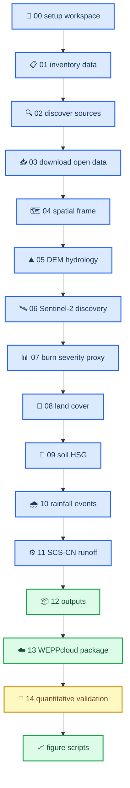

# 中文脚本说明：Lake Varese / Monte Martica post-fire runoff workflow

_这份文档解释 `scripts/` 目录中每个 Python 脚本的用途、输入、输出、为什么存在、和它在 runoff / WEPPcloud workflow 中的位置。Last updated: 2026-07-08._

---

## 📋 快速总览

本项目的 `scripts/` 目录可以理解成四层：

| Layer | Scripts | 作用 |
| --- | --- | --- |
| Numbered pipeline | `00_setup_workspace.py` 到 `13_prepare_weppcloud_package.py` | 从 raw/local data 到 local runoff outputs 和 WEPPcloud input package |
| Post-pipeline validation / sensitivity | `14_quantitative_spatial_qa.py`, `18_burn_severity_ensemble.py`, `38_rainfall_orographic_proxy.py` | 检查结果是否可信，并解释 uncertainty |
| Figure generation | `scripts/figures/*.py` | 生成 `latex/fig*.png` presentation/manuscript figures |
| Shared helpers | `pipeline_utils.py`, `raw_data_utils.py`, `figure_config.py`, `improvement_utils.py`, `scripts/figures/lib/*.py` | 统一路径、CRS、I/O、validation records、plot style、SCS-CN equation |

最常用的完整命令是：

```bash
conda run -n geoproject-auto python scripts/run_pipeline.py --from 04 --to 13 --keep-going --force
conda run -n geoproject-auto python scripts/14_quantitative_spatial_qa.py
conda run -n geoproject-auto python scripts/figures/run_all_atomic_figures.py
```

> ⚠️ **Important:** `data/raw/` 只能读，不能覆盖。所有 metric spatial processing 使用 `EPSG:32632`；`EPSG:4326` 只用于 browser coordinates 和 WGS84 exchange files，例如 WEPPcloud outlet lon/lat。

---

## 🔄 Pipeline mental model

下面这个 diagram 是脚本之间的主要逻辑，不是所有文件依赖的完整 DAG，但足够帮助你理解 workflow。



Feynman 版本：先搭建文件夹和清点数据；再准备 fire / lake / hydrography / DEM / catchment；然后计算 dNBR burn proxy、landcover、soil/HSG、rainfall events；再把这些叠成 `response units`，用 `SCS-CN` 算 local runoff；最后打包 WEPPcloud input，并用 validation records 和 figures 解释结果。

---

## 🎯 如何判断该跑哪个脚本

| 你想做什么 | 应该跑 |
| --- | --- |
| 重新生成 local catchment / DEM hydrology | `scripts/05_prepare_dem.py --force` |
| 重新生成 dNBR / burn severity proxy | `scripts/07_prepare_burn_severity.py --force` |
| 重新生成 land cover response classes | `scripts/08_prepare_landcover.py --force` |
| 重新生成 HSG / soil summary | `scripts/09_prepare_soil.py --force` |
| 重新提取 rainfall events | `scripts/10_prepare_weather.py --force` |
| 重新运行 local SCS-CN runoff | `scripts/11_run_simplified_runoff.py --force` |
| 重新打包 WEPPcloud upload inputs | `scripts/13_prepare_weppcloud_package.py --force` |
| 检查 spatial outputs 是否可接受 | `scripts/14_quantitative_spatial_qa.py` |
| 重画 presentation figures | `scripts/figures/run_all_atomic_figures.py` |
| 只跑正式 pipeline 一段 | `scripts/run_pipeline.py --from 04 --to 13 --keep-going --force` |

> 💡 **Tip:** 如果你改了上游 input，通常要重跑下游脚本。例如改了 `burn_severity_proxy_uint8.tif`，至少要重跑 `11_run_simplified_runoff.py`、`12_generate_outputs.py`、`13_prepare_weppcloud_package.py`、`14_quantitative_spatial_qa.py` 和相关 figures。

---

## 📚 Numbered pipeline scripts

### `scripts/run_pipeline.py`

| 项目 | 说明 |
| --- | --- |
| Purpose | Pipeline orchestrator，按 step number 调用 `00`–`13` |
| Inputs | `--from`, `--to`, `--keep-going`, `--force` 参数 |
| Outputs | 不直接生成 scientific data；它调用各 step 并写 run log / backlog |
| Why it exists | 避免手动逐个运行 numbered scripts；确保失败时可记录 |

`run_pipeline.py` 只认识 `00`–`13`。`14_quantitative_spatial_qa.py`、`18_burn_severity_ensemble.py`、`38_rainfall_orographic_proxy.py` 和 figure scripts 不在 `run_pipeline.py` 的 `STEPS` 字典中，需要单独运行。

### `scripts/00_setup_workspace.py`

| 项目 | 说明 |
| --- | --- |
| Purpose | Bootstrap workspace，创建目录、config files、validation scaffolding、run-log / status files |
| Inputs | `pipeline_utils.py` 中的 default config / path definitions |
| Outputs | `config/project.yaml`, `config/sources.yaml`, `config/paths.yaml`, `qa/audit/README.md`, `qa/evidence/source_manifest.csv`, `qa/evidence/local_data_inventory.csv` 等 |
| Why it exists | 让项目有固定结构，后续脚本都能假设目录存在 |

这个脚本像“整理实验台”。它不做 hydrology，也不做 runoff，只保证 workspace ready。

### `scripts/01_inventory_existing_data.py`

| 项目 | 说明 |
| --- | --- |
| Purpose | 扫描 local raw data，记录文件 metadata |
| Inputs | `data/raw/zip/` 和本地 raster/vector files |
| Outputs | `qa/evidence/local_data_inventory.csv` 等 inventory evidence |
| Why it exists | 记录项目实际有哪些 raw data，避免后面不知道数据来源 |

它只记录 metadata，不应该修改 raw files。它的价值是 provenance：以后别人问“你用了哪些原始文件？”可以查 inventory。

### `scripts/02_discover_sources.py`

| 项目 | 说明 |
| --- | --- |
| Purpose | 检查外部 data sources 是否 reachable，并记录哪些需要 manual download |
| Inputs | `config/sources.yaml` |
| Outputs | `qa/evidence/README.md` 中的 source-discovery / blockers / manual-task entries |
| Why it exists | 把“自动能拿到什么、需要人工下载什么”写清楚 |

它是 data acquisition 的 planning / evidence step，不是 processing step。

### `scripts/03_download_open_data.py`

| 项目 | 说明 |
| --- | --- |
| Purpose | 尝试下载 clear open-access datasets；无法安全自动下载的就登记 blocker |
| Inputs | Step 02 的 source discovery 结果 |
| Outputs | `data/raw/` 中可自动下载的文件；`qa/evidence/README.md` blocker entries |
| Why it exists | 让 open data acquisition 尽可能可复现，同时不强行自动化 interactive portals |

注意：即使下载到 raw data，也要保持 raw data immutable。后续处理应该写到 `data/processed/`、`outputs/` 或 `qa/`。

### `scripts/04_prepare_spatial_frame.py`

| 项目 | 说明 |
| --- | --- |
| Purpose | 准备 spatial frame：processing AOI、official fire perimeter、Lake Varese boundary、hydrography |
| Inputs | raw fire perimeter ZIP、hydrography ZIP、DUSAF/lake-related data |
| Outputs | `data/processed/boundary/processing_aoi_utm32.gpkg`, `lake_varese_boundary.gpkg`, `data/processed/fire_perimeter/monte_martica_fire_2019_utm32.gpkg`, `data/processed/hydrography/streams_lombardia_varese_utm32.gpkg`, `outputs/maps/00_fire_perimeter_check.png`, `outputs/maps/01_processing_aoi_not_final_boundary.png` |
| Why it exists | 在 DEM / burn / runoff 前，先统一 project spatial context |

核心概念：`processing AOI` 不是 hydrologic catchment。它只是 data window / mask。真正 local model boundary 在 `05_prepare_dem.py` 中由 DEM/outlet 生成。

### `scripts/05_prepare_dem.py`

| 项目 | 说明 |
| --- | --- |
| Purpose | 裁剪 DTM5 DEM，生成 hydrologic derivatives，选 outlet candidate，delineate catchment candidate |
| Inputs | `DTM5_RL.zip`, `processing_aoi_utm32.gpkg`, official fire perimeter |
| Outputs | `dem_utm32.tif`, `dem_filled.tif`, `flow_direction.tif`, `flow_accumulation.tif`, `streams_from_dem.gpkg`, `catchment_utm32.gpkg`, `qa/evidence/outlet_candidates.csv`, `outputs/maps/03_final_catchment_fire_hydrography_overlay.png` |
| Why it exists | Runoff model 必须先知道 selected outlet upstream catchment 是哪里 |

实现逻辑：使用 WhiteboxTools 做 `fill depressions`、`D8 pointer`、`D8 flow accumulation`、stream extraction 和 watershed delineation。Outlet candidate 选在 fire perimeter 附近、高 flow accumulation、较低 elevation 的 cell。结果是 candidate，不是 field-validated watershed。

### `scripts/06_discover_sentinel2.py`

| 项目 | 说明 |
| --- | --- |
| Purpose | 找 pre-fire / post-fire Sentinel-2 L2A scenes |
| Inputs | `config/project.yaml` 中的 time windows、本地 SAFE ZIP、Copernicus STAC |
| Outputs | `data/interim/sentinel2/sentinel2_candidates.csv` |
| Why it exists | 为 dNBR burn proxy 选择合适的 pre/post image pair |

它不直接生成 dNBR；它只是 discovery / candidate selection evidence。真正计算在 `07_prepare_burn_severity.py`。

### `scripts/07_prepare_burn_severity.py`

| 项目 | 说明 |
| --- | --- |
| Purpose | 计算 Sentinel-2 `NBR`、`dNBR`，分类为 categorical burn severity proxy |
| Inputs | Sentinel-2 SAFE ZIPs, catchment / AOI, `config/project.yaml` 中 dNBR thresholds |
| Outputs | `nbr_pre.tif`, `nbr_post.tif`, `dnbr_2019_monte_martica.tif`, `burn_severity_proxy_uint8.tif`, `burned_area_proxy.gpkg`, `outputs/tables/burn_severity_area_summary.csv`, `outputs/maps/06_burn_severity_proxy_vs_fire_reference.png` |
| Why it exists | 给 local SCS-CN 和 WEPPcloud package 提供 burn severity proxy |

关键公式：

```text
NBR = (B08 - B12) / (B08 + B12)
dNBR = NBR_pre - NBR_post
```

分类规则：`0=unburned`, `1=low`, `2=moderate`, `3=high`, `255=NoData`。当前 conservative dNBR burned proxy 是 23.80 ha。必须强调：这是 remote-sensing proxy，不是 field soil burn severity。

### `scripts/08_prepare_landcover.py`

| 项目 | 说明 |
| --- | --- |
| Purpose | 将 DUSAF6 land cover reclassify 成 hydrologic classes |
| Inputs | `DUSAF6_REGIONE_LOMBARDIA.zip`, `catchment_utm32.gpkg`, official fire perimeter |
| Outputs | `data/processed/landcover/landcover_utm32.gpkg`, `landcover_hydrologic_class.gpkg`, `outputs/tables/landcover_summary_by_catchment.csv`, `outputs/tables/landcover_summary_by_burned_area.csv` |
| Why it exists | SCS-CN 的 baseline CN 需要 land cover class |

它把 DUSAF classes 简化为 `forest`, `shrub`, `grassland`, `agriculture`, `urban`, `water` 等 hydrologic classes。后续 `11_run_simplified_runoff.py` 会把这些 class 和 HSG / burn class 叠加成 response units。

### `scripts/09_prepare_soil.py`

| 项目 | 说明 |
| --- | --- |
| Purpose | 从 SoilGrids topsoil composites 推导 `Hydrologic Soil Group` / HSG proxy |
| Inputs | `data/raw/zip/soilgrids_lake_varese/` rasters, `catchment_utm32.gpkg` |
| Outputs | `soil_texture_or_hydraulic_utm32.tif`, `hydrologic_soil_group.tif`, `soil_hydraulic_summary.gpkg`, `outputs/tables/soil_summary_by_catchment.csv` |
| Why it exists | SCS-CN 的 CN table 需要 soil/HSG context |

当前项目中 HSG 是 coarse proxy，validation records 中 `soil_resolution` 为 WARN。解释时应说 SoilGrids-derived HSG 是 screening assumption，不是 local field soil survey。

### `scripts/10_prepare_weather.py`

| 项目 | 说明 |
| --- | --- |
| Purpose | 解析 ARPA-style hourly precipitation ZIP，聚合 daily rainfall，提取 post-fire rainfall events |
| Inputs | `data/raw/zip/RW_*.zip`, `config/project.yaml` weather thresholds |
| Outputs | `precipitation_clean_hourly.csv`, `precipitation_clean_daily.csv`, `post_fire_rainfall_events.csv`, `weather_station_inventory.csv`, rainfall event figure for package/reference |
| Why it exists | Local SCS-CN 是 event-based，需要 event rainfall depth |

当前 event rule：`rain day > 1.0 mm`，one dry day gap separates events。当前得到 92 个 rainfall events，主站是 Station 907 `Varese v.Appiani`。

### `scripts/11_run_simplified_runoff.py`

| 项目 | 说明 |
| --- | --- |
| Purpose | 构建 response units，并对每个 rainfall event 运行 simplified SCS-CN screening model |
| Inputs | `landcover_hydrologic_class.gpkg`, HSG summary, `burn_severity_proxy_uint8.tif`, `post_fire_rainfall_events.csv`, `config/project.yaml` CN tables |
| Outputs | `data/processed/model_inputs/runoff_units.gpkg`, `outputs/tables/runoff_units.csv`, `runoff_event_summary.csv`, `runoff_delta_by_event.csv`, `sensitivity_summary.csv`, `outputs/maps/07_runoff_delta_event_main.png` |
| Why it exists | 这是 local runoff result 的主脚本 |

关键逻辑：

1. 把 land cover 与 positive dNBR burn classes 叠加成 `response units`。
2. 每个 response unit 有 `baseline_parameter` 和 `burned_parameter`，也就是 CN。
3. 对每个 rainfall event，分别算 `baseline`, `burned`, `sensitivity_low`, `sensitivity_high`。
4. 输出 `burned - baseline` 的 `delta_runoff_mm` 和 `delta_volume_m3`。

当前 conservative max ΔQ 约 0.281785 mm / 3,696 m³。

### `scripts/12_generate_outputs.py`

| 项目 | 说明 |
| --- | --- |
| Purpose | 汇总 outputs，复制 report-ready tables，更新 validation audit sections |
| Inputs | Steps 04–11 的 processed outputs 和 tables |
| Outputs | `outputs/tables/post_fire_rainfall_events.csv`, 更新 `qa/audit/README.md` |
| Why it exists | 把分散 outputs 整理成 report / audit 可读的形式 |

它不是新的模型计算脚本，而是 reporting / validation consolidation step。

### `scripts/13_prepare_weppcloud_package.py`

| 项目 | 说明 |
| --- | --- |
| Purpose | Assemble WEPPcloud input package |
| Inputs | `burn_severity_proxy_uint8.tif`, catchment reference, fire reference, hydrography reference, outlet candidate table, selected maps/screenshots |
| Outputs | `outputs/models/weppcloud/lake_varese_monte_martica_weppcloud_input_package.zip`, `input_package/` 中的 burn raster、outlet CSV、reference GeoJSON、overview、screenshots |
| Why it exists | WEPPcloud webpage 是 manual step，需要可追溯的 upload/reference package |

注意：这个脚本只准备 WEPPcloud input，不运行 WEPPcloud。WEPPcloud run、outlet snapping、watershed delineation 是 manual webpage operation。

---

## 🧪 Validation and sensitivity scripts

### `scripts/14_quantitative_spatial_qa.py`

| 项目 | 说明 |
| --- | --- |
| Purpose | Numeric spatial validation，避免只凭 map visual inspection 接受结果 |
| Inputs | catchment、fire、hydrography、DEM rasters、burn raster、HSG raster、runoff units、outlet point |
| Outputs | `qa/spatial/quantitative_spatial_qa_summary.json`, `qa/spatial/qa_decisions.csv`, `qa/spatial/*.csv`, `outputs/maps/08_quantitative_spatial_qa.png` |
| Why it exists | 给 CRS、grid alignment、burn raster domain、fire/catchment overlap、outlet plausibility、soil resolution 提供数字证据 |

当前 validation overall decision 是 `WARN`。主要原因是 selected outlet/catchment 只代表官方火场的一部分 drainage area，且 HSG resolution 比 DEM 粗。

### `scripts/15_run_verified_initial_automation.py`

| 项目 | 说明 |
| --- | --- |
| Purpose | 记录 automation/manual boundary |
| Inputs | 当前 pipeline context |
| Outputs | manual-boundary report / HTML / PDF / CSV style artifacts |
| Why it exists | 明确 phases 00–13 可以 scriptable，但 WEPPcloud webpage 不能假装全自动 |

它的重点不是 scientific computation，而是 reproducibility / process integrity：WEPPcloud 是 manual transition。

### `scripts/18_burn_severity_ensemble.py`

| 项目 | 说明 |
| --- | --- |
| Purpose | 构建 burn-severity proxy ensemble 和 uncertainty ladder |
| Inputs | `nbr_pre.tif`, `nbr_post.tif`, `dnbr_2019_monte_martica.tif`, `burn_severity_proxy_uint8.tif`, EFFIS context raster, catchment/fire vectors |
| Outputs | `outputs/tables/burn_severity_ensemble_summary.csv`, `burn_index_sensitivity_summary.csv`, `outputs/figures/burn_severity_ensemble_map.png`, `burned_footprint_area_hierarchy.png`, `burned_footprint_runoff_response.png`, `qa/burn_severity_qa.md`, raster metadata CSV |
| Why it exists | 解释 conservative / relaxed / upper-bound burned footprint uncertainty |

关键 scenarios：

| Scenario | Meaning | Current result |
| --- | --- | ---: |
| `conservative_dnbr_proxy` | current dNBR thresholds + valid mask | 23.80 ha |
| `relaxed_dnbr_proxy` | relaxed thresholds | 55.36 ha |
| `official_fire_perimeter_upper_bound` | official fire overlap treated as upper-bound burned footprint | 280.76 ha |
| `effis_2019_context` | external context only | 357.20 ha |

### `scripts/38_rainfall_orographic_proxy.py`

| 项目 | 说明 |
| --- | --- |
| Purpose | Rainfall orographic sensitivity analysis |
| Inputs | ARPA rainfall station data, DEM-derived elevation context, catchment location |
| Outputs | `outputs/tables/rainfall_orographic_sensitivity.csv`, rainfall station / IDW / elevation-aware comparison figures or tables |
| Why it exists | 检查 single-station rainfall forcing 是否可能因为 elevation / orographic effects 产生 uncertainty |

它是 sensitivity script，不是 main pipeline 的必要 step。当前解释中应把它作为 rainfall uncertainty evidence，而不是替换主 rainfall event series。

---

## 📈 Figure scripts

Figure scripts 位于 `scripts/figures/`，输出主要在 `latex/`。它们通常不重新计算核心 GIS/model outputs，而是读取 `data/processed/`、`outputs/tables/`、`qa/` 中已经存在的数据并画图。

### `scripts/figures/run_all_atomic_figures.py`

| 项目 | 说明 |
| --- | --- |
| Purpose | 依次运行所有 atomic figure scripts |
| Inputs | `scripts/figures/fig*.py` |
| Outputs | `latex/fig01a_north_Italy.png` 到 `latex/fig09_weppcloud_sediment.png` |
| Why it exists | 一键重画 presentation / manuscript figure suite |

### Core atomic figure scripts

| Script | Output | Reads | 这张图解释什么 |
| --- | --- | --- | --- |
| `fig01a_regional_context.py` | `latex/fig01a_north_Italy.png` | Natural Earth countries/lakes, study bounds | 研究区在 northern Italy / Lombardy / Lake Varese 的位置 |
| `fig01c_local_domain.py` | `latex/fig01c_local_domain.png` | catchment, fire, streams, lake, DEM | Local analytical domain；official fire 不全在当前 catchment 内 |
| `fig02_dem_hydrology_qa.py` | `latex/fig02_dem_hydrology_qa.png` | DEM, DEM streams, hydrography, outlet | Outlet/catchment hydrologic plausibility validation |
| `fig03_response_units_cn.py` | `latex/fig03_response_units_map.png` | `runoff_units.gpkg` | Response units 中哪里发生 CN adjustment |
| `fig04_response_unit_cn_adjustment.py` | `latex/fig04_response_unit_cn_adjustment.png` | `runoff_units.gpkg` | Burned response units 的 area 和 CN increase |
| `fig04_event_rainfall_response.py` | `latex/fig04_event_rainfall_response.png` | rainfall events + runoff delta table | Event rainfall depth 与 modelled ΔQ 的关系 |
| `fig05_burn_footprint_area.py` | `latex/fig05_burn_footprint_area.png` | `burn_severity_ensemble_summary.csv` | Conservative / relaxed / upper-bound burned area |
| `fig06_burn_runoff_response.py` | `latex/fig06_burn_runoff_response.png` | `burn_severity_ensemble_summary.csv` | Burn footprint 如何传导到 max runoff ΔQ |
| `fig07_event_delta_cdf.py` | `latex/fig07_event_delta_cdf.png` | `runoff_delta_by_event.csv` + ensemble summary | 92 events 的 ΔQ distribution；防止只看最大值 |
| `fig08_sensitivity_hierarchy.py` | `latex/fig08_sensitivity_hierarchy.png` | burn, index, rainfall, IA, soil sensitivity tables | 哪类 uncertainty 最影响 max ΔQ |
| `fig09_weppcloud_sediment.py` | `latex/fig09_weppcloud_sediment.png` | WEPPcloud summary numbers | WEPPcloud sediment signal：293.0 → 652.6 tonne/yr |

### `scripts/figures/lib/io.py`

| 项目 | 说明 |
| --- | --- |
| Purpose | Shared I/O helpers for figure scripts |
| Key functions | `load_vector()`, `load_table()`, `outlet_point_utm()` |
| Why it exists | 避免每张 figure 重复写路径和 CRS conversion code |

### `scripts/figures/lib/figure_style.py`

| 项目 | 说明 |
| --- | --- |
| Purpose | Shared figure style for atomic figures |
| Key features | Muted colorblind-safe palette, 600 DPI, `save_atomic_figure()` |
| Why it exists | 保持 `latex/fig*.png` 视觉一致，适合 Overleaf embedding |

---

## 🔧 Shared helper scripts

### `scripts/pipeline_utils.py`

| 项目 | 说明 |
| --- | --- |
| Purpose | 全 pipeline 的核心工具库 |
| Includes | `ROOT`, `WORKING_CRS`, `WGS84`, path helpers, config helpers, `StepLog`, run log, source manifest, raster/vector validation, raster/vector write helpers, SCS-CN equation |
| Why it exists | 确保所有脚本用同一套路径、CRS、validation records、logging、SCS-CN 公式 |

特别重要的是 canonical SCS-CN function：

```text
S = 25400 / CN - 254
Ia = 0.2 * S
Q = (P - Ia)^2 / (P + 0.8 * S), if P > Ia
```

`pipeline_utils.py` 是项目的“中枢神经”。如果你改这里的 CRS、paths、SCS-CN 公式，会影响很多脚本。

### `scripts/raw_data_utils.py`

| 项目 | 说明 |
| --- | --- |
| Purpose | 读取 project-owner supplied raw ZIP datasets，不修改 raw files |
| Includes | raw ZIP path constants, Sentinel-2 SAFE ZIP band reading, DTM ZIP reading, weather ZIP discovery |
| Why it exists | 把 raw archive access 和 processing logic 分开，保护 raw data immutability |

### `scripts/figure_config.py`

| 项目 | 说明 |
| --- | --- |
| Purpose | Canonical manuscript figure configuration |
| Includes | Figure sizes, fonts, palettes, map decorators, scale bar, CRS label, QGIS-like layout helpers |
| Why it exists | 让 maps / figures 有一致的 style、DPI、caption 和 uncertainty-aware layout |

### `scripts/improvement_utils.py`

| 项目 | 说明 |
| --- | --- |
| Purpose | Scientific improvement / audit helper functions |
| Includes | Shared constants, plot helpers, markdown table helpers, raster metadata helpers, canonical SCS-CN imports |
| Why it exists | 支持 later improvement scripts，例如 burn ensemble / sensitivity audit |

### `scripts/utilities/scientific_fig_style.py`

| 项目 | 说明 |
| --- | --- |
| Purpose | Unified final-report figure style |
| Includes | `apply_style()`, `save_figure()` style helpers |
| Why it exists | 为 publication/final report figures 提供统一视觉风格 |

---

## 🧠 核心数据流：每类结果来自哪些脚本

### Catchment / outlet

| Result | Produced by | Used by |
| --- | --- | --- |
| `processing_aoi_utm32.gpkg` | `04_prepare_spatial_frame.py` | DEM, burn, reference maps |
| `catchment_utm32.gpkg` | `05_prepare_dem.py` | burn clipping, landcover clipping, runoff units, WEPPcloud reference |
| `outlet_candidates.csv` | `05_prepare_dem.py` | WEPPcloud package, validation |
| `outputs/maps/03_final_catchment_fire_hydrography_overlay.png` | `05_prepare_dem.py` | presentation, WEPPcloud reference screenshots |

### Burn severity proxy

| Result | Produced by | Used by |
| --- | --- | --- |
| `nbr_pre.tif`, `nbr_post.tif` | `07_prepare_burn_severity.py` | dNBR and ensemble validation |
| `dnbr_2019_monte_martica.tif` | `07_prepare_burn_severity.py` | burn classification / sensitivity |
| `burn_severity_proxy_uint8.tif` | `07_prepare_burn_severity.py` | local SCS-CN, WEPPcloud package, validation |
| `burn_severity_ensemble_summary.csv` | `18_burn_severity_ensemble.py` | `fig05`, `fig06`, uncertainty explanation |

### Local SCS-CN runoff

| Result | Produced by | Meaning |
| --- | --- | --- |
| `runoff_units.gpkg` / `runoff_units.csv` | `11_run_simplified_runoff.py` | landcover × HSG × burn class response units |
| `runoff_event_summary.csv` | `11_run_simplified_runoff.py` | baseline / burned / sensitivity scenarios per event |
| `runoff_delta_by_event.csv` | `11_run_simplified_runoff.py` | event-level `burned - baseline` ΔQ |
| `outputs/maps/07_runoff_delta_event_main.png` | `11_run_simplified_runoff.py` | spatial map of CN adjustment |

### WEPPcloud

| Result | Produced by | Meaning |
| --- | --- | --- |
| `lake_varese_monte_martica_weppcloud_input_package.zip` | `13_prepare_weppcloud_package.py` | Manual WEPPcloud upload/reference package |
| WEPPcloud disturbed / undisturbed output CSVs | Manual WEPPcloud webpage export | Process-model water balance / sediment benchmark |
| `WEPPcloud_vs_SCS_CN_COMPARISON.md` | Post-run comparison artifact | Explains why WEPPcloud is benchmark, not validation |

---

## ⚠️ Common pitfalls

### Do not confuse AOI and catchment

`processing_aoi_utm32.gpkg` comes from `04_prepare_spatial_frame.py` and is only a processing mask. The model catchment comes from `05_prepare_dem.py` and selected outlet / D8 hydrology.

### Do not confuse dNBR proxy and field soil burn severity

`07_prepare_burn_severity.py` creates `burn_severity_proxy_uint8.tif`. It is a remote-sensing-derived proxy, not field-validated soil burn severity.

### Do not treat WEPPcloud as automatic pipeline step

`13_prepare_weppcloud_package.py` prepares upload files. It does not run WEPPcloud. `15_run_verified_initial_automation.py` exists partly to document this manual boundary.

### Do not compare local ΔQ directly with WEPPcloud stream discharge

`11_run_simplified_runoff.py` produces event-scale `direct runoff` differences. WEPPcloud produces continuous water-balance / stream-discharge / sediment outputs. They are complementary, not same-unit validation.

### Do not accept maps without numeric validation

`outputs/maps/08_quantitative_spatial_qa.png` is context only. Acceptance comes from `qa/spatial/*.csv` and `quantitative_spatial_qa_summary.json`.

---

## ✅ Recommended reading order for understanding scripts

1. Read `scripts/run_pipeline.py` to see official 00–13 order.
2. Read `scripts/pipeline_utils.py` for constants, CRS, logging, SCS-CN equation.
3. Read `04_prepare_spatial_frame.py` and `05_prepare_dem.py` to understand spatial domain.
4. Read `07_prepare_burn_severity.py` to understand conservative dNBR proxy.
5. Read `08_prepare_landcover.py`, `09_prepare_soil.py`, `10_prepare_weather.py` to understand model inputs.
6. Read `11_run_simplified_runoff.py` to understand local runoff result.
7. Read `13_prepare_weppcloud_package.py` and `outputs/models/weppcloud/WEPPcloud_vs_SCS_CN_COMPARISON.md` to understand benchmark boundary.
8. Read `14_quantitative_spatial_qa.py` before trusting any map.
9. Read `scripts/figures/*.py` only after you understand which tables each figure visualizes.

---

## 🔗 Related documents

| Document | Why read it |
| --- | --- |
| `docs/FIGURE_EXPLANATION_GUIDE_CN.md` | Explains what each figure means and how it was calculated |
| `docs/PROJECT_CN.md` | Concise Chinese project summary |
| `docs/PROJECT_SUMMARY.md` | Current key results and claim guardrails |
| `docs/REPRODUCIBILITY.md` | Commands, CRS policy, validation status |
| `outputs/models/weppcloud/WEPPcloud_vs_SCS_CN_COMPARISON.md` | WEPPcloud benchmark interpretation |
| `qa/spatial/qa_decisions.md` | Numeric spatial validation decisions |

### `scripts/16_select_lake_response_events.py`

| 项目 | 说明 |
| --- | --- |
| Purpose | Thin legacy wrapper；调用 `scripts/lake_wq/compute_select_events.py` |
| Inputs | `outputs/tables/runoff_delta_by_event.csv`, `outputs/tables/post_fire_rainfall_events.csv` |
| Outputs | `outputs/tables/lake_response_selected_events.csv` |
| Why it exists | 不重跑 runoff model，只把最相关 high-runoff events 传给 Python-only Sentinel-2 lake proxy module |

Ranking logic 先用 `delta_volume_m3`，没有时 fallback 到 `delta_runoff_mm`，再 fallback 到 `total_precip_mm`。

### `scripts/17_prepare_sentinel2_lake_water_quality.py`

| 项目 | 说明 |
| --- | --- |
| Purpose | Thin legacy wrapper；调用 `scripts/lake_wq/run_compute_lake_wq.py` |
| Inputs | selected events, Lake Varese boundary, local Sentinel-2 SAFE ZIPs, ARPA analytical water-quality table |
| Outputs | ROI GPKG, local SAFE image metadata, anomaly table, validation table, analytical context table |
| Why it exists | 保持旧入口可运行，但 active workflow 是 Python-only，不生成或依赖 GEE helper |

### `scripts/lake_wq/` Python-only lake WQ module

| Script | Main role |
| --- | --- |
| `config.py` | Central paths, CRS, validation columns, anomaly columns, and 20 m Sentinel-2 target-grid settings |
| `io.py` | CSV/validation/raster metadata helpers |
| `s2_safe.py` | Reads local Sentinel-2 L2A SAFE ZIPs only; B3/B4/B5/SCL on a documented 20 m grid |
| `compute_select_events.py` | Selects top runoff events from existing tables |
| `compute_rois.py` | Creates `whole_lake`, `near_inlet_or_north_shore`, `lake_center_control` in EPSG:32632 |
| `compute_s2_indices.py` | Attempts local NDTI/NDCI rasters for event windows and writes `MISSING_LOCAL_IMAGE` if coverage is absent |
| `compute_zonal_anomalies.py` | Computes ROI zonal anomalies when rasters exist; otherwise writes data-limited placeholder rows |
| `compute_analytical_context.py` | Summarizes ARPA lake observations as context only |
| `run_compute_lake_wq.py` | Runs all compute steps in order |
| `figures/run_lake_wq_figures.py` | Runs fig10–fig13; placeholder figures are generated when local event coverage is insufficient |

当前 local Sentinel-2 SAFE 只覆盖 2018-12 / 2019-01，不能覆盖 selected high-runoff events。因此 validation records 使用 `MISSING_LOCAL_IMAGE`，而不是 silently failing、inventing anomaly values 或使用 GEE。
